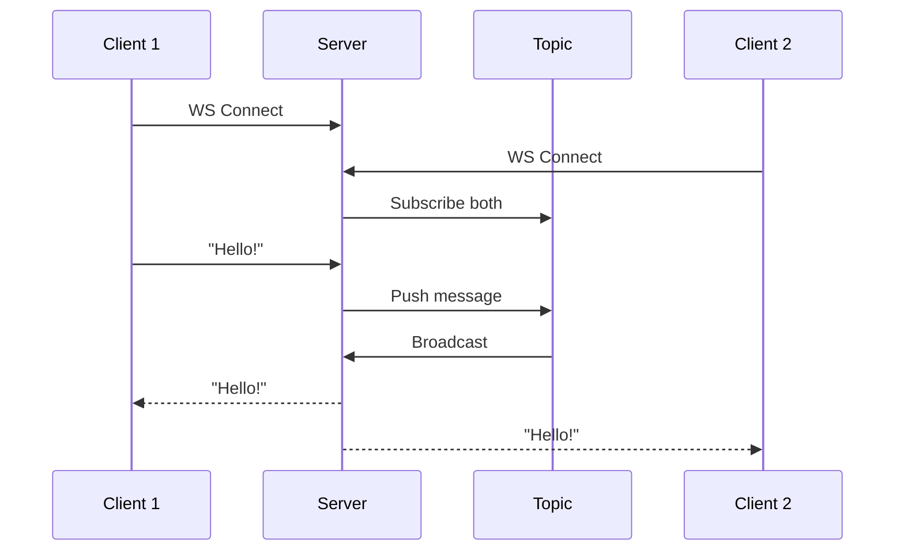

# Introducing the Zef VSCode Plugin

**Jupyter notebooks, evolved. Write Markdown. Run Python and Rust. Reproduce anything.**

---

## The 10-Second Pitch

The Zef VSCode Plugin turns `.zef.md` files into executable documents. Write prose with Python and Rust code together. Run code blocks interactively. Every result is automatically tracked and reproducible.

---





## See It in Action

This document you're reading? It's executable. Try it:


In Rust:
```rust
println!("The answer is {}", 40 + 2);
1.2345
```
````Result
1.2345
````
````Side Effects
[
    ET.UnmanagedEffect(
        what='stdout',
        content='The answer is 42'
    )
]
````


we can also add function definitions and call them later.
```rust
fn multiply(a: i32, b: i32) -> i32 {
    a * b
}
multiply(6, 7)
```
````Result
42
````
````Side Effects
[]
````


Or Python:
```python
from zef import *

print('🌿 an spurious side effect: printing to stdout 11🌿')
sales = [1200, 800, 1500, 910]

print('🌿 an spurious side effect: printing to stdout 🔥')

sales | sum | collect
```
````Result
4410
````
````Side Effects
[
    ET.UnmanagedEffect(
        what='stdout',
        content='🌿 an spurious side effect: printing to stdout 11🌿'
    ),
    ET.UnmanagedEffect(
        what='stdout',
        content='🌿 an spurious side effect: printing to stdout 🔥'
    )
]
````
Or JS

```javascript
console.log('Hello from JavaScript!');
[1, 2, 3, 4, 50].reduce((a, b) => a + b, 0);
```
````Result
60
````
````Side Effects
[
    ET.UnmanagedEffect(
        what='stdout',
        content='Hello from JavaScript!'
    )
]
````
Or TS

```typescript
// console.log('Hello from TypeScript!');
const numbers: number[] = [10, 20, 30, 40, 1];
numbers.reduce((a, b) => a + b, 0);
```
````Result
101
````
````Side Effects
[]
````


Or

```python
from zef import *

ET.Foo(icon='🌿')
```
````Result
ET.Foo(icon='🌿')
````
````Side Effects
[]
````


Check the tabs above: **Code** | **Output** | **Side Effects**

---

## Functions Are Stored by Hash

When you define a function, Zef stores it by its content hash—like git, but for functions:

```python
'hello' + ' world!'
```
````Result
'hello world!'
````
````Side Effects
[]
````


The function `average` now has a unique hash (e.g., `#a7f2c3`). Same code = same hash, everywhere, forever.

---

## Build on Previous Blocks

Code blocks share state, just like notebooks. But with a key difference: Zef tracks the entire lineage.

```python
[4,5 ] + [6,7,9,8]
```
````Result
[4, 5, 6, 7, 9, 8]
````
````Side Effects
[]
````

Every function and value is tracked by hash. Six months later, you can reproduce this exact result.

---

## Why Not Just Use Jupyter?

| | Jupyter | Zef |
|---|---------|-----|
| **Editor** | Basic web UI | Full VS Code |
| **Languages** | Python only | Python + Rust |
| **State** | Hidden, fragile | Tracked, reproducible |
| **Sharing** | Export files | Share by hash |
| **Dependencies** | requirements.txt 🙏 | Locked by hash |

---

## The Power of Content-Addressing

Here's the key insight: when code is identified by *what it does* (its hash) rather than *where it lives* (a file path), powerful things become possible:

```python
# Imagine this pipeline:
# raw_data (#d1) → clean (#f1) → analyze (#f2) → result (#d2)

raw_data = [100, None, 250, 75, None, 420]

def clean(data):
    """Remove None values."""
    return [x for x in data if x is not None]

def analyze(data):
    """Basic statistics."""
    return {
        'count': len(data),
        'total': sum(data),
        'average': sum(data) / len(data),
        'min': min(data),
        'max': max(data)
    }

result = analyze(clean(raw_data))
print(result)
```

**What Zef tracks:**
- `raw_data` → hash of the input
- `clean` → hash of the function
- `analyze` → hash of the function  
- `result` → hash of the output

The complete provenance is recorded. Need to audit how a result was computed? It's all there.

---

## Seamless Python + Rust Interop

Zef's core is written in Rust. This means you can write performance-critical functions in Rust—directly in your Markdown—and use them immediately from Python.

**Define a Rust function:**

```rust
fn fast_sum(numbers: Vec<i64>) -> i64 {
    numbers.iter().sum()
}
```

**Call it from Python in the next block:**

```python
# The Rust function is available immediately
data = list(range(1_000_000))
result = fast_sum(data)
print(f"Sum of 0..999,999: {result:,}")
```

Why mix languages?

- **Python** for expressiveness: data wrangling, exploration, quick iteration
- **Rust** for performance: hot loops, heavy computation, type safety

Both are stored by hash. Both track provenance. One seamless workflow.

---

## Everything You Love About VS Code

Unlike Jupyter's web editor, you're in VS Code. That means:

- All your extensions work
- Real debugger integration
- Git integration that makes sense
- Vim/Emacs bindings, multi-cursor, whatever you prefer
- Proper autocomplete and intellisense

```python
# Use any Python library you'd normally use
import datetime
print(f"Document executed: {datetime.datetime.now()}")

[3,4,True,'🔥']*10

```
````Result
[3, 4, True, '🔥', 3, 4, True, '🔥', 3, 4, True, '🔥', 3, 4, True, '🔥', 3, 4, True, '🔥', 3, 4, True, '🔥', 3, 4, True, '🔥', 3, 4, True, '🔥', 3, 4, True, '🔥', 3, 4, True, '🔥']
````
````Side Effects
[
    ET.UnmanagedEffect(
        what='stdout',
        content='Document executed: 2026-01-12 12:17:59.572127'
    )
]
````


---

## Get Started

1. Install the Zef VSCode extension
2. Create any file ending in `.zef.md`
3. Write Python in fenced code blocks
4. Open the preview panel (Cmd+Shift+P → "Zef: Open Preview")
5. Run your code

**That's it.** Your Markdown is now executable, trackable, and shareable.

---

## What's Next?

- Define functions that persist in the Zef codebase
- Share code with other Zef users by hash
- Build reproducible data pipelines
- Never wonder "how did I compute this?" again

Welcome to reproducible interactive computing. 🚀

---

## Svelte Components (Coming Soon)

Embed live, interactive Svelte components directly in your documents. Minimal code, maximum impact.

### Animated Gradient Button

A sleek button with an animated gradient border. Hover to see the glow intensify:

```svelte
<script>
  let clicked = 0;
</script>

<button on:click={() => clicked++}>
  {clicked === 0 ? 'Click me' : `Clicked ${clicked}×`}
</button>

<style>
  button {
    padding: 12px 28px;
    font-size: 14px;
    font-weight: 500;
    color: #fafafa;
    background: linear-gradient(135deg, #1a1a2e 0%, #16213e 100%);
    border: 1px solid transparent;
    border-radius: 8px;
    cursor: pointer;
    position: relative;
    overflow: hidden;
    transition: all 0.3s ease;
  }
  button::before {
    content: '';
    position: absolute;
    inset: -2px;
    background: linear-gradient(90deg, #667eea, #764ba2, #f093fb, #667eea);
    background-size: 300% 100%;
    z-index: -1;
    border-radius: 10px;
    animation: gradient 3s linear infinite;
    opacity: 0.5;
    transition: opacity 0.3s;
  }
  button:hover::before { opacity: 1; }
  button:hover { transform: translateY(-2px); box-shadow: 0 10px 40px rgba(102, 126, 234, 0.3); }
  @keyframes gradient { 0% { background-position: 0% 50%; } 100% { background-position: 300% 50%; } }
</style>
```


### Pulse Ring

An Apple-style notification pulse. Pure Svelte + CSS:

```svelte
<script>
  import { onMount } from 'svelte';
  let active = true;
</script>

<div class="container" on:click={() => active = !active}>
  <div class="dot" class:active></div>
  {#if active}
    <div class="ring ring-1"></div>
    <div class="ring ring-2"></div>
    <div class="ring ring-3"></div>
  {/if}
</div>

<style>
  .container { position: relative; width: 60px; height: 60px; cursor: pointer; }
  .dot {
    position: absolute; top: 50%; left: 50%; transform: translate(-50%, -50%);
    width: 16px; height: 16px; background: #34d399; border-radius: 50%;
    transition: background 0.3s;
  }
  .dot.active { background: #10b981; }
  .ring {
    position: absolute; top: 50%; left: 50%; transform: translate(-50%, -50%);
    border: 2px solid #34d399; border-radius: 50%; opacity: 0;
    animation: pulse 2s cubic-bezier(0, 0, 0.2, 1) infinite;
  }
  .ring-1 { width: 30px; height: 30px; animation-delay: 0s; }
  .ring-2 { width: 45px; height: 45px; animation-delay: 0.5s; }
  .ring-3 { width: 60px; height: 60px; animation-delay: 1s; }
  @keyframes pulse { 0% { opacity: 0.6; transform: translate(-50%, -50%) scale(0.5); } 100% { opacity: 0; transform: translate(-50%, -50%) scale(1); } }
</style>
```


### Shimmer Loading Card

A Linear-style loading skeleton with a shimmer effect:

```svelte
<div class="card">
  <div class="shimmer avatar"></div>
  <div class="content">
    <div class="shimmer line title"></div>
    <div class="shimmer line subtitle"></div>
    <div class="shimmer line short"></div>
  </div>
</div>

<style>
  .card {
    display: flex; gap: 16px; padding: 20px;
    background: #0a0a0a; border: 1px solid #222; border-radius: 12px;
    max-width: 320px;
  }
  .avatar { width: 48px; height: 48px; border-radius: 50%; flex-shrink: 0; }
  .content { flex: 1; display: flex; flex-direction: column; gap: 8px; }
  .line { height: 12px; border-radius: 6px; }
  .title { width: 70%; }
  .subtitle { width: 100%; }
  .short { width: 40%; }
  .shimmer {
    background: linear-gradient(90deg, #1a1a1a 25%, #2a2a2a 50%, #1a1a1a 75%);
    background-size: 200% 100%;
    animation: shimmer 1.5s infinite;
  }
  @keyframes shimmer { 0% { background-position: 200% 0; } 100% { background-position: -200% 0; } }
</style>
```
