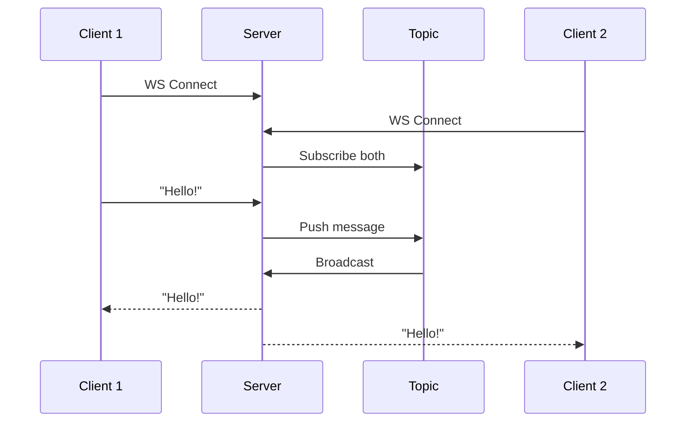

# Introducing the Zef VSCode Plugin

**Jupyter notebooks, evolved. Write Markdown. Run Python and Rust. Reproduce anything.**

---

## The 10-Second Pitch

The Zef VSCode Plugin turns `.zef.md` files into executable documents. Write prose with Python and Rust code together. Run code blocks interactively. Every result is automatically tracked and reproducible.

---





## See It in Action

This document you're reading? It's executable. Try it:


In Rust:
```rust
println!("The answer is {}", 40 + 2);
1.2345
```
````Result
1.2345
````
````Side Effects
[
    ET.UnmanagedEffect(
        what='stdout',
        content='The answer is 42'
    )
]
````


we can also add function definitions and call them later.
```rust
fn multiply(a: i32, b: i32) -> i32 {
    a * b
}
multiply(6, 7)
```
````Result
42
````
````Side Effects
[]
````


Or Python:
```python
from zef import *

print('🌿 an spurious side effect: printing to stdout 11🌿')
sales = [1200, 800, 1500, 910]

print('🌿 an spurious side effect: printing to stdout 🔥')

sales | sum | collect
```
````Result
4410
````
````Side Effects
[
    ET.UnmanagedEffect(
        what='stdout',
        content='🌿 an spurious side effect: printing to stdout 11🌿'
    ),
    ET.UnmanagedEffect(
        what='stdout',
        content='🌿 an spurious side effect: printing to stdout 🔥'
    )
]
````
Or JS

```javascript
console.log('Hello from JavaScript!');
[1, 2, 3, 4, 50].reduce((a, b) => a + b, 0);
```
````Result
60
````
````Side Effects
[
    ET.UnmanagedEffect(
        what='stdout',
        content='Hello from JavaScript!'
    )
]
````
Or TS

```typescript
// console.log('Hello from TypeScript!');
const numbers: number[] = [10, 20, 30, 40, 1];
numbers.reduce((a, b) => a + b, 0);
```
````Result
101
````
````Side Effects
[]
````


Or

```python
from zef import *

ET.Foo(icon='🌿')
```
````Result
ET.Foo(icon='🌿')
````
````Side Effects
[]
````


Check the tabs above: **Code** | **Output** | **Side Effects**

---

## Functions Are Stored by Hash

When you define a function, Zef stores it by its content hash—like git, but for functions:

```python
'hello' + ' world!'
```
````Result
'hello world!'
````
````Side Effects
[]
````


The function `average` now has a unique hash (e.g., `#a7f2c3`). Same code = same hash, everywhere, forever.

---

## Build on Previous Blocks

Code blocks share state, just like notebooks. But with a key difference: Zef tracks the entire lineage.

```python
[4,5 ] + [6,7,9,8]
```
````Result
[4, 5, 6, 7, 9, 8]
````
````Side Effects
[]
````

Every function and value is tracked by hash. Six months later, you can reproduce this exact result.

---

## Why Not Just Use Jupyter?

| | Jupyter | Zef |
|---|---------|-----|
| **Editor** | Basic web UI | Full VS Code |
| **Languages** | Python only | Python + Rust |
| **State** | Hidden, fragile | Tracked, reproducible |
| **Sharing** | Export files | Share by hash |
| **Dependencies** | requirements.txt 🙏 | Locked by hash |

---

## The Power of Content-Addressing

Here's the key insight: when code is identified by *what it does* (its hash) rather than *where it lives* (a file path), powerful things become possible:

```python
# Imagine this pipeline:
# raw_data (#d1) → clean (#f1) → analyze (#f2) → result (#d2)

raw_data = [100, None, 250, 75, None, 420]

def clean(data):
    """Remove None values."""
    return [x for x in data if x is not None]

def analyze(data):
    """Basic statistics."""
    return {
        'count': len(data),
        'total': sum(data),
        'average': sum(data) / len(data),
        'min': min(data),
        'max': max(data)
    }

result = analyze(clean(raw_data))
print(result)
```

**What Zef tracks:**
- `raw_data` → hash of the input
- `clean` → hash of the function
- `analyze` → hash of the function  
- `result` → hash of the output

The complete provenance is recorded. Need to audit how a result was computed? It's all there.

---

## Seamless Python + Rust Interop

Zef's core is written in Rust. This means you can write performance-critical functions in Rust—directly in your Markdown—and use them immediately from Python.

**Define a Rust function:**

```rust
fn fast_sum(numbers: Vec<i64>) -> i64 {
    numbers.iter().sum()
}
```

**Call it from Python in the next block:**

```python
# The Rust function is available immediately
data = list(range(1_000_000))
result = fast_sum(data)
print(f"Sum of 0..999,999: {result:,}")
```

Why mix languages?

- **Python** for expressiveness: data wrangling, exploration, quick iteration
- **Rust** for performance: hot loops, heavy computation, type safety

Both are stored by hash. Both track provenance. One seamless workflow.

---

## Everything You Love About VS Code

Unlike Jupyter's web editor, you're in VS Code. That means:

- All your extensions work
- Real debugger integration
- Git integration that makes sense
- Vim/Emacs bindings, multi-cursor, whatever you prefer
- Proper autocomplete and intellisense

```python
# Use any Python library you'd normally use
import datetime
print(f"Document executed: {datetime.datetime.now()}")

[3,4,True,'🔥']*10

```
````Result
[3, 4, True, '🔥', 3, 4, True, '🔥', 3, 4, True, '🔥', 3, 4, True, '🔥', 3, 4, True, '🔥', 3, 4, True, '🔥', 3, 4, True, '🔥', 3, 4, True, '🔥', 3, 4, True, '🔥', 3, 4, True, '🔥']
````
````Side Effects
[
    ET.UnmanagedEffect(
        what='stdout',
        content='Document executed: 2026-01-12 12:17:59.572127'
    )
]
````


---

## Get Started

1. Install the Zef VSCode extension
2. Create any file ending in `.zef.md`
3. Write Python in fenced code blocks
4. Open the preview panel (Cmd+Shift+P → "Zef: Open Preview")
5. Run your code

**That's it.** Your Markdown is now executable, trackable, and shareable.

---

## What's Next?

- Define functions that persist in the Zef codebase
- Share code with other Zef users by hash
- Build reproducible data pipelines
- Never wonder "how did I compute this?" again

Welcome to reproducible interactive computing. 🚀

---

## Svelte Components (Coming Soon)

Embed live, interactive Svelte components directly in your documents. Minimal code, maximum impact.

### Animated Gradient Button

A sleek button with an animated gradient border. Hover to see the glow intensify:

```svelte
<script>
  let clicked = 0;
</script>

<button on:click={() => clicked++}>
  {clicked === 0 ? 'Click me' : `Clicked ${clicked}×`}
</button>

<style>
  button {
    padding: 12px 28px;
    font-size: 14px;
    font-weight: 500;
    color: #fafafa;
    background: linear-gradient(135deg, #1a1a2e 0%, #16213e 100%);
    border: 1px solid transparent;
    border-radius: 8px;
    cursor: pointer;
    position: relative;
    overflow: hidden;
    transition: all 0.3s ease;
  }
  button::before {
    content: '';
    position: absolute;
    inset: -2px;
    background: linear-gradient(90deg, #667eea, #764ba2, #f093fb, #667eea);
    background-size: 300% 100%;
    z-index: -1;
    border-radius: 10px;
    animation: gradient 3s linear infinite;
    opacity: 0.5;
    transition: opacity 0.3s;
  }
  button:hover::before { opacity: 1; }
  button:hover { transform: translateY(-2px); box-shadow: 0 10px 40px rgba(102, 126, 234, 0.3); }
  @keyframes gradient { 0% { background-position: 0% 50%; } 100% { background-position: 300% 50%; } }
</style>
```


### Profiler Compact View

```svelte
<script>
  let hoveredSpan = $state(null);
  let mousePos = $state({ x: 0, y: 0 });
  
  const trace = {
    traceId: 'trace-abc123',
    totalDuration: 156,
    spans: [
      { id: 'span-1', name: 'api.handleRequest', hash: 'abc123', node: 'node-1', start: 0, duration: 156, parentId: null },
      { id: 'span-2', name: 'auth.validate', hash: 'def456', node: 'node-1', start: 5, duration: 18, parentId: 'span-1' },
      { id: 'span-3', name: 'db.getUser', hash: 'ghi789', node: 'node-2', start: 25, duration: 45, parentId: 'span-1', isRemote: true },
      { id: 'span-4', name: 'cache.check', hash: 'jkl012', node: 'node-2', start: 28, duration: 8, parentId: 'span-3' },
      { id: 'span-5', name: 'db.query', hash: 'mno345', node: 'node-2', start: 38, duration: 28, parentId: 'span-3' },
      { id: 'span-6', name: 'transform.response', hash: 'pqr678', node: 'node-1', start: 72, duration: 12, parentId: 'span-1' },
      { id: 'span-7', name: 'log.request', hash: 'stu901', node: 'node-3', start: 85, duration: 68, parentId: 'span-1', isRemote: true },
      { id: 'span-8', name: 'serialize.result', hash: 'vwx234', node: 'node-1', start: 140, duration: 12, parentId: 'span-1' },
      { id: 'span-9', name: 'metrics.record', hash: 'yza567', node: 'node-3', start: 92, duration: 20, parentId: 'span-7' },
      { id: 'span-10', name: 'db.secondQuery', hash: 'bcd890', node: 'node-2', start: 68, duration: 14, parentId: 'span-3' },
    ]
  };
  
  const nodeColors = { 'node-1': '#3b82f6', 'node-2': '#10b981', 'node-3': '#f59e0b' };
  
  function getDepth(spanId) {
    const span = trace.spans.find(s => s.id === spanId);
    if (!span || !span.parentId) return 0;
    return 1 + getDepth(span.parentId);
  }
  
  function handleMouseMove(e) {
    mousePos = { x: e.clientX, y: e.clientY };
  }
</script>

<div class="compact-container" onmousemove={handleMouseMove}>
  <div class="header">
    <span class="icon">▬</span>
    <span class="title">Trace: Compact Dense View</span>
    <span class="span-count">{trace.spans.length} spans</span>
  </div>
  
  <div class="compact-view">
    <div class="time-ruler">
      {#each [0, 40, 80, 120, 156] as ms}
        <span class="tick" style="left: {(ms / trace.totalDuration) * 100}%">
          <span class="tick-line"></span>
          <span class="tick-label">{ms}</span>
        </span>
      {/each}
    </div>
    
    <div class="spans-area">
      {#each trace.spans as span}
        {@const depth = getDepth(span.id)}
        <button 
          class="compact-row"
          onmouseenter={() => hoveredSpan = span}
          onmouseleave={() => hoveredSpan = null}
        >
          <div class="compact-label" style="padding-left: {depth * 8 + 4}px">
            <span class="dot" style="background: {nodeColors[span.node]}"></span>
            <span class="name">{span.name}</span>
          </div>
          <div class="compact-track">
            <div 
              class="compact-bar"
              style="
                left: {(span.start / trace.totalDuration) * 100}%;
                width: {Math.max((span.duration / trace.totalDuration) * 100, 1)}%;
                background: {nodeColors[span.node]};
              "
            ></div>
          </div>
        </button>
      {/each}
    </div>
  </div>
  
  {#if hoveredSpan}
    <div class="hover-tooltip" style="left: {mousePos.x + 15}px; top: {mousePos.y - 40}px;">
      <div class="tooltip-title">{hoveredSpan.name}</div>
      <div class="tooltip-stats">
        <span>{hoveredSpan.node}</span>
        <span>{hoveredSpan.start}ms → {hoveredSpan.start + hoveredSpan.duration}ms</span>
        <span>{hoveredSpan.duration}ms</span>
      </div>
    </div>
  {/if}
  
  <div class="legend">
    {#each Object.entries(nodeColors) as [node, color]}
      <span class="legend-item">
        <span class="dot" style="background: {color}"></span>
        {node}
      </span>
    {/each}
  </div>
  
  <div class="insight">
    <span class="insight-icon">💡</span>
    Compact view shows up to 20+ spans without scrolling. Hover for details.
  </div>
</div>

<style>
  .compact-container {
    background: #0a0a0c;
    border: 1px solid rgba(255, 255, 255, 0.08);
    border-radius: 16px;
    padding: 24px;
    position: relative;
  }
  
  .header {
    display: flex;
    align-items: center;
    gap: 10px;
    margin-bottom: 16px;
  }
  
  .icon { color: #10b981; font-size: 20px; }
  .title { font-size: 14px; font-weight: 500; color: #e4e4e7; flex: 1; }
  .span-count { font-size: 10px; color: #52525b; }
  
  .compact-view {
    background: rgba(0, 0, 0, 0.3);
    border-radius: 10px;
    padding: 10px;
    margin-bottom: 16px;
  }
  
  .time-ruler {
    position: relative;
    height: 20px;
    margin-left: 100px;
    margin-bottom: 4px;
    border-bottom: 1px solid rgba(255, 255, 255, 0.06);
  }
  
  .tick {
    position: absolute;
    display: flex;
    flex-direction: column;
    align-items: center;
  }
  
  .tick-line {
    width: 1px;
    height: 6px;
    background: rgba(255, 255, 255, 0.1);
  }
  
  .tick-label {
    font-family: 'SF Mono', monospace;
    font-size: 8px;
    color: #3f3f46;
  }
  
  .spans-area {
    display: flex;
    flex-direction: column;
    gap: 1px;
  }
  
  .compact-row {
    display: flex;
    align-items: center;
    height: 18px;
    background: none;
    border: none;
    cursor: pointer;
    width: 100%;
  }
  
  .compact-row:hover {
    background: rgba(255, 255, 255, 0.03);
  }
  
  .compact-label {
    width: 100px;
    flex-shrink: 0;
    display: flex;
    align-items: center;
    gap: 6px;
  }
  
  .dot {
    width: 6px;
    height: 6px;
    border-radius: 50%;
    flex-shrink: 0;
  }
  
  .name {
    font-family: 'SF Mono', monospace;
    font-size: 9px;
    color: #a1a1aa;
    white-space: nowrap;
    overflow: hidden;
    text-overflow: ellipsis;
  }
  
  .compact-track {
    flex: 1;
    height: 12px;
    position: relative;
    background: rgba(255, 255, 255, 0.02);
    border-radius: 2px;
  }
  
  .compact-bar {
    position: absolute;
    height: 100%;
    border-radius: 2px;
    min-width: 3px;
  }
  
  .hover-tooltip {
    position: fixed;
    background: #18181b;
    border: 1px solid rgba(255, 255, 255, 0.1);
    border-radius: 8px;
    padding: 10px 14px;
    pointer-events: none;
    z-index: 1000;
    box-shadow: 0 4px 20px rgba(0, 0, 0, 0.5);
  }
  
  .tooltip-title {
    font-family: 'SF Mono', monospace;
    font-size: 12px;
    color: #e4e4e7;
    margin-bottom: 6px;
  }
  
  .tooltip-stats {
    display: flex;
    gap: 12px;
    font-size: 10px;
    color: #71717a;
  }
  
  .legend {
    display: flex;
    justify-content: center;
    gap: 20px;
    margin-bottom: 16px;
  }
  
  .legend-item {
    display: flex;
    align-items: center;
    gap: 6px;
    font-size: 10px;
    color: #52525b;
  }
  
  .insight {
    display: flex;
    align-items: center;
    gap: 10px;
    padding: 12px 16px;
    background: rgba(16, 185, 129, 0.05);
    border-radius: 10px;
    font-size: 12px;
    color: #a1a1aa;
  }
  
  .insight-icon { font-size: 16px; }
</style>
```
