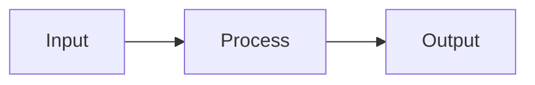

# Zef

Lightweight Jupyter-style notebooks in Markdown. Write executable documents with code, results, and visualizations — all in plain `.zef.md` files.

## Why Zef?

Zef brings the power of Jupyter notebooks to Markdown files:

- **Lightweight** — Plain text files, no special notebook format
- **Executable** — Run code blocks directly in VS Code
- **Embeddable results** — Output is stored inline, share files with results included
- **Beautiful rendering** — Dark theme preview with LaTeX math, Mermaid diagrams, and Excalidraw sketches
- **Inline editing** — Edit Excalidraw diagrams directly in VS Code with a visual editor
- **Svelte components** — Define and render interactive components inline

## Features

### Code Execution

Execute code blocks in multiple languages:

- **Python** — Full support with expression output (like Jupyter cells)
- **Rust** — Compile and run
- **JavaScript / TypeScript** — Bun execution

The final expression of a code block is captured as **output** — just like Jupyter. Side effects are tracked and can be displayed.

**Run code:**
- Click the **▶ Run** button above any code block
- Press **Shift+Enter** to run the block at cursor
- Press **Cmd+Enter** (Mac) / **Ctrl+Enter** (Windows) as alternative

### Embedded Results

Results from code execution can be embedded directly in the Markdown file. This allows you to share `.zef.md` files complete with the outputs — like Jupyter notebooks, but in plain Markdown.

### Content-Addressed Storage

For large inputs or outputs, Zef uses a **content-hashing system**:

- Any value can be identified by its content hash
- Hashes serve as compact placeholders in your document
- Sync with the Zef Distributed Hash Store happens transparently
- Links never go stale — no version conflicts or cache invalidation

### Live Preview

Press **Cmd+Shift+V** to open a beautifully rendered preview:

- Elegant dark theme with minimalist styling
- **LaTeX math equations** with KaTeX — use `$...$` for inline and `$$...$$` for block equations
- **Mermaid diagrams** rendered automatically
- **Excalidraw diagrams** with inline editing — click the ✏️ pencil icon to edit directly in VS Code
- Syntax highlighting for all major languages
- **Auto-folding** of Excalidraw blocks to keep your document readable
- Live updates as you type

Excalidraw blocks render by default and include a Source Code tab. Click the pencil icon to open an interactive editor panel. You can optionally widen a block:

````markdown
```excalidraw width=wide
{ "type": "excalidraw", "version": 2, "elements": [], "appState": { "viewBackgroundColor": "#0b0b0b" } }
```
````

### LaTeX Math Equations

Render beautiful mathematical notation with KaTeX:

**Inline math:** Write `$E = mc^2$` to render inline equations.

**Block equations:** Use double dollar signs for centered equations:

```markdown
$$
\int_{-\infty}^{\infty} e^{-x^2} dx = \sqrt{\pi}
$$
```

### Svelte Components

Define Svelte components directly in code blocks:

- Components are compiled and rendered inline
- Interactive UI elements in your documents
- Compiled output can be embedded for sharing

## Usage

1. Create a file with `.zef.md` extension
2. Write markdown with code blocks:

```markdown
# My Analysis

Some explanatory text...

```python
data = [1, 2, 3, 4, 5]
sum(data) / len(data)  # Output: 3.0
```


```

3. Click **▶ Run** to execute code blocks
4. Press **Cmd+Shift+V** to open the preview panel

## Commands

| Command | Keybinding | Description |
|---------|------------|-------------|
| Zef: Run Code Block | — | Run the code block (via CodeLens) |
| Zef: Run Code Block at Cursor | Shift+Enter | Run block at cursor |
| Zef: Open Preview | Cmd+Shift+V | Open rendered preview panel |
| Zef: Select Python Interpreter | — | Choose Python environment |
| Zef: Restart Kernel | — | Restart the execution kernel |

## Building from Source

### Quick Build (Recommended)

Use the interactive build script:

```bash
# Interactive mode - shows menu with options
python3 build.py

# Development workflow (build + local install)
python3 build.py dev

# Clean dev build
python3 build.py dev --clean

# Publish to marketplace (bumps version automatically)
python3 build.py publish
```

The build script handles:
- Cleaning stale build artifacts
- Removing old extension versions
- Version management
- Installation verification

### Manual Build

```bash
git clone https://github.com/UlfBissbort/zef-vscode-extension.git
cd zef-vscode-extension

npm install
npm run compile
npx vsce package
code --install-extension zef-*.vsix --force
```

After installing, reload VS Code: **Cmd+Shift+P** → **Reload Window**

## Documentation

- **[Runtime Requirements](docs/RUNTIME_REQUIREMENTS.md)** — Installing Python, Rust, and Bun
- **[Internal Architecture](notes/INTERNAL_ARCHITECTURE.md)** — How the extension works under the hood
- **[Architecture Overview](notes/ARCHITECTURE.md)** — High-level design and file structure

## Requirements

- VS Code 1.85.0 or higher
- Python 3.x (for Python code execution) — [installation guide](docs/RUNTIME_REQUIREMENTS.md#python)
- Bun (for JS/TS execution) — [installation guide](docs/RUNTIME_REQUIREMENTS.md#bun)
- Rust toolchain (optional, for Rust code execution) — [installation guide](docs/RUNTIME_REQUIREMENTS.md#rust)
- Node.js (for building from source only)

> **New to these tools?** Check our [Runtime Requirements Guide](docs/RUNTIME_REQUIREMENTS.md) for step-by-step installation instructions.

## License

MIT
