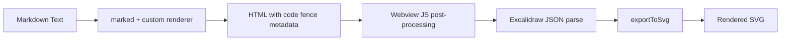

# Excalidraw Support in Zef Preview

## Context
Zef already renders Markdown into a custom webview with rich block handling (Mermaid, HTML, Svelte, runnable code). This document defines a robust, local-only Excalidraw rendering path for fenced code blocks and sets the foundation for a future modal editor.

## Requirements
| ID | Requirement | Priority | Notes |
| --- | --- | --- | --- |
| R1 | Render fenced ```excalidraw blocks into a visual diagram | Must | Rendered view is default tab |
| R2 | Provide a Source Code tab for Excalidraw blocks | Must | Shows raw JSON |
| R3 | Support width overrides per block | Must | `width=wide` or `width=full` on fence info string |
| R4 | Preserve current Markdown rendering and code-block features | Must | No regressions |
| R5 | Work offline with packaged assets | Must | No remote CDN at runtime |
| R6 | Fail gracefully on invalid Excalidraw JSON | Must | Rendered tab shows error text |
| R7 | Keep rendering logic pure where possible | Should | Parsing and normalization are pure functions |
| R8 | Leave space for a future modal editor | Should | Rendered block exposes hooks |

## Non-Goals (For This Iteration)
- Full in-webview editing of Excalidraw scenes
- Live bidirectional sync between editor and rendered view
- Support for embedding `.excalidraw` files via image links

## Proposed Architecture
**High-level data flow**


**Key integration points**
- [src/previewPanel.ts](../src/previewPanel.ts):
  - Custom `marked` renderer to capture width metadata.
  - Webview JS to detect `language-excalidraw` blocks, build tabs, and render SVG.
  - Add `excalidraw.production.min.js` to webview assets.

## Rendering Behavior
1. The fenced code block is detected by `language-excalidraw`.
2. The block is replaced by a tabbed container:
   - **Rendered**: default visible tab containing the SVG output.
   - **Source Code**: shows the raw JSON.
3. Rendering uses `ExcalidrawLib.exportToSvg()` with `elements`, `appState`, and `files` from the JSON.

## Width Handling
Blocks can request additional width by adding metadata to the info string:
- ` ```excalidraw width=wide`
- ` ```excalidraw width=full`

The renderer writes `data-zef-width="wide|full"` on the `<pre>` tag, and the webview JS applies a CSS class to the container:
- `.excalidraw-wide`: up to 1100px, uses a viewport breakout pattern.
- `.excalidraw-full`: full viewport width minus padding.

## Error Handling
- Invalid JSON results in a gentle inline error in the Rendered tab.
- Rendering exceptions log to console and show a fallback message.

## Security & Robustness
- No remote assets at runtime; all renderer code is bundled in `assets/`.
- The SVG output is inserted into the DOM without script execution.
- Rendering is defensive and won’t crash the preview.

## Future Modal Editor (Planned)
A future modal can reuse this structure:
- Clicking “Expand” in a rendered block opens a fullscreen modal.
- Modal can host Excalidraw’s full React editor using the same scene JSON.
- On save, the scene JSON is written back to the fenced block.

## Test Plan (Incremental)
1. **Parse**: render JSON into SVG for a simple Excalidraw scene.
2. **Tabs**: verify Rendered/Source toggles work.
3. **Width**: verify `width=wide` and `width=full` break out.
4. **Invalid JSON**: verify graceful errors.
5. **Regression**: Mermaid/HTML/Svelte blocks still render correctly.

## Pure Functions (Preferred)
- `parseExcalidrawData(raw: string) -> ExcalidrawScene | null`
- `normalizeAppState(scene) -> appState`

Side-effect functions:
- `renderExcalidraw(targetEl, raw, widthMode)`

## Implementation Steps
1. Vendor `excalidraw.production.min.js` into `assets/`.
2. Extend `renderMarkdown()` to capture `width=` metadata.
3. Add Excalidraw handling in the webview script.
4. Add CSS for the container and width variants.
5. Add display-only decoration for Excalidraw blocks in the editor.
