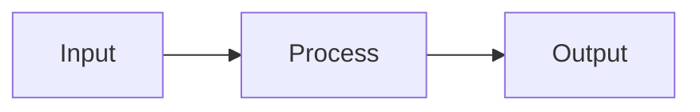
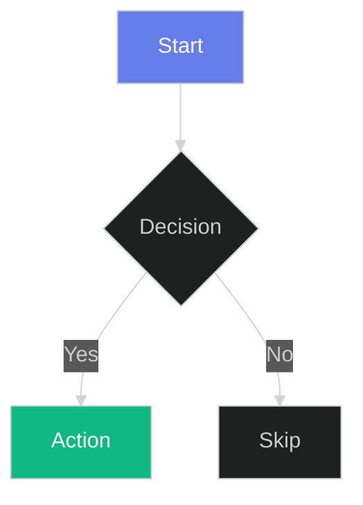
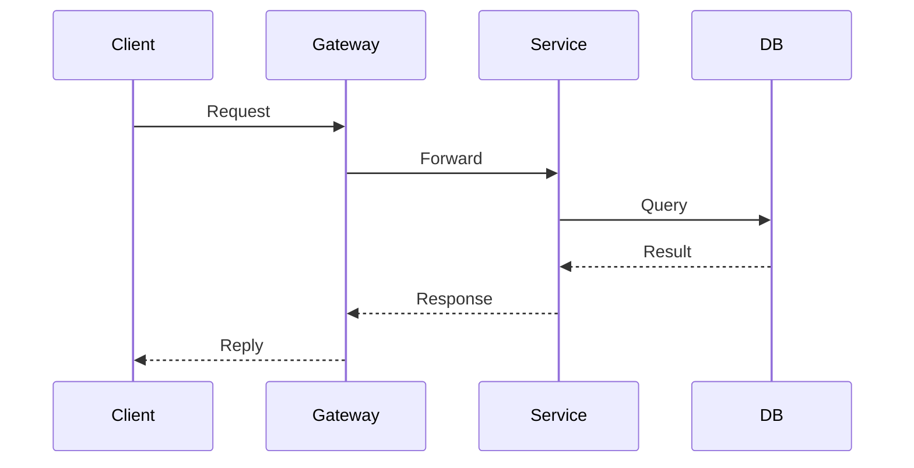
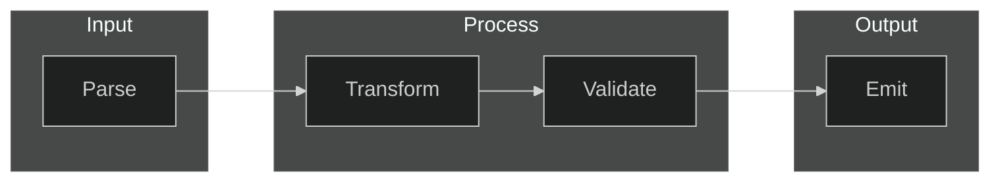

# Using Zef Markdown

> **Write documentation that lives with your code, renders beautifully, and versions with git.**

Zef transforms Markdown into an interactive, visual medium. This guide shows you how to write effective documentation using diagrams, equations, and structured content—all within files you can commit alongside your source.

---

## Where to Use Zef

| File Type | Markdown Syntax | Best For |
|-----------|-----------------|----------|
| `.md` | Standard Markdown | README files, guides, standalone docs |
| `.py` | `"""md ... """` blocks | Python module documentation |
| `.rs` | `/*md ... */` blocks | Rust crate and function documentation |

All three render identically in the Zef preview. Press `Cmd/Ctrl+Shift+P` → "Zef: Show Preview" on any supported file.

---

## Quick Syntax Reference

### Mermaid Diagrams

Use for: **Architecture, flowcharts, sequences, state machines**

````markdown

````
an actual diagram:


### LaTeX Equations

Use for: **Math, formulas, scientific notation**

```markdown
Inline: $E = mc^2$

Block:
$$
\int_0^\infty e^{-x^2} dx = \frac{\sqrt{\pi}}{2}
$$
```

Inline: $E = mc^2$

$$
\int_0^\infty e^{-x^2} dx = \frac{\sqrt{\pi}}{2}
$$

### Excalidraw Sketches

Use for: **Conceptual diagrams, informal illustrations, whiteboard-style explanations**

```excalidraw
{
  "elements": [
    {
      "type": "rectangle",
      "x": 301,
      "y": 571,
      "width": 375,
      "height": 204,
      "strokeColor": "#343a40",
      "roundness": {
        "type": 3
      }
    },
    {
      "type": "ellipse",
      "x": 361.96875,
      "y": 593.921875,
      "width": 80.7265625,
      "height": 78.91015625,
      "strokeColor": "#343a40",
      "strokeWidth": 2
    },
    {
      "id": "dBrEQdPHKS5YDHcqPUYPG",
      "type": "ellipse",
      "x": 554.00390625,
      "y": 592.6796875,
      "width": 80.7265625,
      "height": 78.91015625,
      "angle": 0,
      "strokeColor": "#343a40",
      "backgroundColor": "transparent",
      "fillStyle": "solid",
      "strokeWidth": 2,
      "strokeStyle": "solid",
      "roughness": 1,
      "opacity": 100,
      "groupIds": [],
      "frameId": null,
      "index": "a2",
      "roundness": {
        "type": 2
      },
      "seed": 145785424,
      "version": 194,
      "versionNonce": 211554896,
      "isDeleted": false,
      "boundElements": [
        {
          "id": "4V9F6OQbNIz6ady_JDNEF",
          "type": "arrow"
        }
      ],
      "updated": 1769608443285,
      "link": null,
      "locked": false
    },
    {
      "id": "dCZq7ayCvtkk91LlZc2e1",
      "type": "ellipse",
      "x": 461.0625,
      "y": 686.2890625,
      "width": 80.7265625,
      "height": 78.91015625,
      "angle": 0,
      "strokeColor": "#343a40",
      "backgroundColor": "transparent",
      "fillStyle": "solid",
      "strokeWidth": 2,
      "strokeStyle": "solid",
      "roughness": 1,
      "opacity": 100,
      "groupIds": [],
      "frameId": null,
      "index": "a3",
      "roundness": {
        "type": 2
      },
      "seed": 595990704,
      "version": 232,
      "versionNonce": 50072656,
      "isDeleted": false,
      "boundElements": [
        {
          "id": "alULUFjmS86139EARHoTy",
          "type": "arrow"
        }
      ],
      "updated": 1769608439232,
      "link": null,
      "locked": false
    },
    {
      "id": "alULUFjmS86139EARHoTy",
      "type": "arrow",
      "x": 438.1875,
      "y": 669.25,
      "width": 32.28125,
      "height": 27.55859375,
      "angle": 0,
      "strokeColor": "#343a40",
      "backgroundColor": "transparent",
      "fillStyle": "solid",
      "strokeWidth": 2,
      "strokeStyle": "solid",
      "roughness": 1,
      "opacity": 100,
      "groupIds": [],
      "frameId": null,
      "index": "a4",
      "roundness": {
        "type": 2
      },
      "seed": 1403231824,
      "version": 37,
      "versionNonce": 236672592,
      "isDeleted": false,
      "boundElements": [],
      "updated": 1769608439232,
      "link": null,
      "locked": false,
      "points": [
        [
          0,
          0
        ],
        [
          32.28125,
          27.55859375
        ]
      ],
      "lastCommittedPoint": null,
      "startBinding": {
        "elementId": "DFuXPVYbs7N8UNthvkBv1",
        "focus": 0.07120681649064922,
        "gap": 10.816311040141041
      },
      "endBinding": {
        "elementId": "dCZq7ayCvtkk91LlZc2e1",
        "focus": 0.0339240915161829,
        "gap": 2.4418952659669855
      },
      "startArrowhead": null,
      "endArrowhead": "arrow",
      "elbowed": false
    },
    {
      "id": "4V9F6OQbNIz6ady_JDNEF",
      "type": "arrow",
      "x": 455.15625,
      "y": 630.390625,
      "width": 89.44140625,
      "height": 1.62890625,
      "angle": 0,
      "strokeColor": "#343a40",
      "backgroundColor": "transparent",
      "fillStyle": "solid",
      "strokeWidth": 2,
      "strokeStyle": "solid",
      "roughness": 1,
      "opacity": 100,
      "groupIds": [],
      "frameId": null,
      "index": "a5",
      "roundness": {
        "type": 2
      },
      "seed": 1941834416,
      "version": 64,
      "versionNonce": 1538517680,
      "isDeleted": false,
      "boundElements": [],
      "updated": 1769608446600,
      "link": null,
      "locked": false,
      "points": [
        [
          0,
          0
        ],
        [
          89.44140625,
          -1.62890625
        ]
      ],
      "lastCommittedPoint": null,
      "startBinding": {
        "elementId": "DFuXPVYbs7N8UNthvkBv1",
        "focus": -0.05036787936796812,
        "gap": 12.548244801260815
      },
      "endBinding": {
        "elementId": "dBrEQdPHKS5YDHcqPUYPG",
        "focus": 0.1064799876408866,
        "gap": 9.524678976984042
      },
      "startArrowhead": null,
      "endArrowhead": "arrow",
      "elbowed": false
    }
  ],
  "appState": {
    "viewBackgroundColor": "#121212",
    "currentItemStrokeColor": "#343a40",
    "currentItemBackgroundColor": "transparent",
    "currentItemFillStyle": "solid",
    "currentItemStrokeWidth": 2,
    "currentItemRoughness": 1,
    "currentItemOpacity": 100,
    "currentItemFontFamily": 5,
    "currentItemFontSize": 20,
    "currentItemTextAlign": "left",
    "currentItemRoundness": "round",
    "gridSize": 20
  },
  "files": {}
}
```


Excalidraw blocks are **editable inline**—click to modify directly in the preview.

### Tables

Use for: **Comparisons, specifications, structured data**


| Feature | Pros | Cons |
|---------|------|------|
| Enums | Pattern matching, inline | Closed to extension |
| Traits | Open, flexible | Indirect dispatch |

---

## Dark Mode Rendering

Zef renders all content in a dark theme. Mermaid diagrams automatically adapt.

### Color Guidelines

**Use color sparingly.** Prefer the default dark theme. When you need emphasis:

| Color | Hex | Use For |
|-------|-----|---------|
| Purple | `#667eea` | Primary concepts, main flow |
| Green | `#10b981` | Success states, completed items |
| Orange | `#f59e0b` | Warnings, important notes |
| Red | `#ef4444` | Errors, critical paths |
| Cyan | `#06b6d4` | Secondary information, links |

### Mermaid with Colors



**Tip:** Apply color to 1-2 key nodes only. Let the rest use defaults.

---

## When to Use Each Component

### Mermaid Diagrams

✅ **Use for:**
- System architecture and data flow
- Decision trees and flowcharts
- Sequence diagrams (API calls, protocols)
- State machines and lifecycles
- Class hierarchies

❌ **Avoid for:**
- Freeform sketches (use Excalidraw)
- Simple lists (use bullet points)
- Single relationships (use inline text)

### Excalidraw

✅ **Use for:**
- Conceptual illustrations
- Whiteboard-style explanations
- Informal sketches
- Diagrams that need artistic freedom

❌ **Avoid for:**
- Structured flowcharts (use Mermaid)
- Anything needing text-based diffs

### LaTeX

✅ **Use for:**
- Mathematical equations
- Scientific formulas
- Complexity notation ($O(n \log n)$)
- Type theory and formal notation

❌ **Avoid for:**
- Simple superscripts/subscripts (use HTML)
- Non-mathematical content

### Tables

✅ **Use for:**
- Feature comparisons
- API parameter documentation
- Lookup references
- Structured specifications

❌ **Avoid for:**
- Sequential steps (use numbered lists)
- Hierarchical data (use nested lists)

---

## Best Practices

### 1. Keep Docs Close to Code

```python
def calculate_entropy(data: list[float]) -> float:
    """md
    ## Shannon Entropy
    
    Measures the information content in bits:
    
    $$H(X) = -\sum_{i=1}^{n} p(x_i) \log_2 p(x_i)$$
    
    Where $p(x_i)$ is the probability of symbol $x_i$.
    """
    import math
    return -sum(p * math.log2(p) for p in data if p > 0)
```

### 2. Prefer Text Over Diagrams

Start with prose. Add diagrams only when they clarify relationships that text cannot.

**Before:**
> "The request goes to the gateway, which forwards to the service, which queries the database."

**After adding a diagram:**



### 3. Use Consistent Styling

Pick a color scheme and stick to it:



### 4. Version-Friendly Content

- **Mermaid and LaTeX** are text-based → clean git diffs
- **Excalidraw** stores JSON → works but diffs are noisy
- **Images** are binary → avoid when possible

