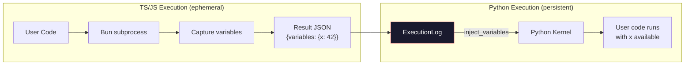
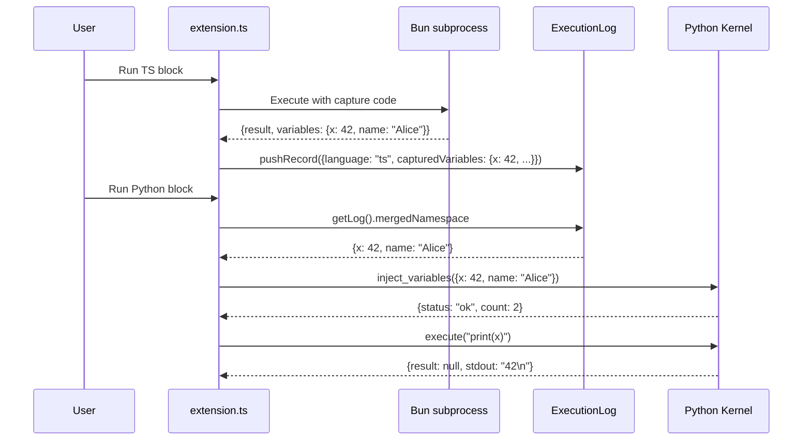
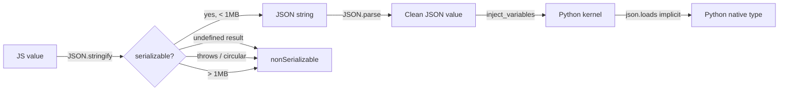
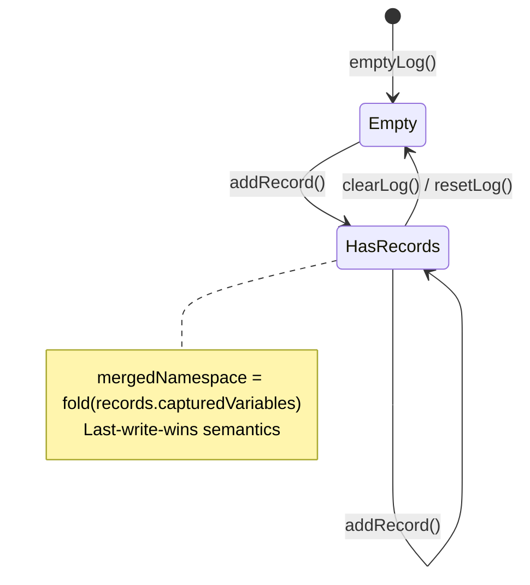

# Cross-Language Variable Sharing

> **Status**: Implemented
> **Scope**: TS/JS → Python variable injection in Zef notebook execution

## Problem

Zef notebooks (`.zef.md` files) contain code blocks in multiple languages — TypeScript, JavaScript, and Python — executed in sequence. Each language has a fundamentally different execution model:

| Language | Runtime | Lifetime | State |
|----------|---------|----------|-------|
| **Python** | Long-lived kernel subprocess (`zef_kernel.py`) | Persists across all cell executions | Mutable `self.namespace` dict |
| **TypeScript** | Bun subprocess per cell | Ephemeral — dies after each execution | Lost on exit |
| **JavaScript** | Bun subprocess per cell | Ephemeral — dies after each execution | Lost on exit |

The problem: **variables defined in a TS/JS block are invisible to subsequent Python blocks**, even though users naturally expect a notebook's state to flow forward across all cells regardless of language.

```
┌──────────────────────┐     ┌───────────────────────┐
│  ```ts               │     │  ```python            │
│  const x = 42        │ ──? │  print(x)  ← NameError│
│  const name = "Alice"│     │  ```                  │
│  ```                 │     └───────────────────────┘
└──────────────────────┘
      TS process dies             Python kernel has
      variables lost              no knowledge of x
```

## Solution Overview

Capture JSON-serializable variables from every TS/JS execution, accumulate them in an in-memory log, and **inject them into the Python kernel** before each Python cell runs.



## Architecture

### Data Flow



### Components

```
┌──────────────────────────────────────────────────────────────────────┐
│  extension.ts  (orchestrator)                                        │
│                                                                      │
│  runJsCode() / runTsCode()         runCodeInKernel()                 │
│    ├─ execute{Js,Ts}()               ├─ getLog().mergedNamespace     │
│    ├─ pushRecord(capturedVars)        ├─ kernel.injectVariables()    │
│    └─ send result to webview          ├─ kernel.execute()            │
│                                       └─ pushRecord()                │
├──────────────────────────────────────────────────────────────────────┤
│                                                                      │
│  evalAndCapture.ts              executionLog.ts                      │
│  (pure functions)               (pure data + singleton)              │
│                                                                      │
│  extractDeclaredVariables()     ExecutionRecord {                    │
│  evalAndCapture()                 language, contentHash,             │
│                                   capturedVariables,                 │
│                                   nonSerializable,                   │
│                                   executedAt, durationMs             │
│                                 }                                    │
│                                                                      │
│                                 ExecutionLog {                       │
│                                   records[],                         │
│                                   mergedNamespace                    │
│                                 }                                    │
├──────────────┬──────────────┬────────────────────────────────────────┤
│ jsExecutor   │ tsExecutor   │ kernelManager.ts + zef_kernel.py       │
│ (Bun, JS)    │ (Bun, TS)    │ (Python subprocess)                    │
│              │              │                                        │
│ Generates    │ Generates    │ inject_variables command:              │
│ capture code │ capture code │   kernel.namespace.update(variables)   │
│ inline in    │ inline in    │                                        │
│ exec script  │ exec script  │ Persistent InteractiveInterpreter      │
└──────────────┴──────────────┴────────────────────────────────────────┘
```


## Key Design Decisions

### 1. Regex-based variable extraction (not a parser)

`extractDeclaredVariables()` uses regex to find top-level declarations:

```typescript
// const/let/var
/(?:^|\n)\s*(?:export\s+)?(?:const|let|var)\s+(\w+)/g

// Object destructuring: const { a, b: renamed } = ...
/(?:^|\n)\s*(?:export\s+)?(?:const|let|var)\s+\{([^}]+)\}/g

// Array destructuring: const [a, b] = ...
/(?:^|\n)\s*(?:export\s+)?(?:const|let|var)\s+\[([^\]]+)\]/g

// function / class declarations
/(?:^|\n)\s*(?:export\s+)?(?:async\s+)?function\s+(\w+)/g
/(?:^|\n)\s*(?:export\s+)?class\s+(\w+)/g
```

> [!info] Why not the TypeScript compiler?
> The `typescript` package is a `devDependency` — it's available during development but **not bundled** into the VS Code extension at runtime. Using `ts.createSourceFile()` causes a `Cannot find module 'typescript'` error when the extension activates. Regex works without runtime dependencies.

> [!note] False positives are safe
> The regex may pick up variables declared inside function bodies or comments. These are **harmless**: the capture code wraps each variable access in `try/catch`, so out-of-scope names silently fail.


### 2. Capture code runs *inside* the IIFE

TS/JS code is wrapped in an async IIFE: `(async () => { ...userCode... })()`. Variables declared with `const`/`let` inside an IIFE are **block-scoped** — they're invisible from outside.

The capture code must therefore run **inside the IIFE**, writing to an outer-scope object:

```javascript
// Outer scope — accessible from anywhere
let __zef_captured = {};
let __zef_nonser = [];

(async () => {
    // User code (const x = 42 is scoped HERE)
    const x = 42;
    const name = "Alice";

    // Capture code — runs inside the same scope
    try { const __v = x; const __s = JSON.stringify(__v);
          if (__s !== undefined && __s.length < 1000000)
              __zef_captured["x"] = JSON.parse(__s);
          else __zef_nonser.push("x");
    } catch { __zef_nonser.push("x"); }

    // ... same for "name" ...

    return name;  // last expression return (if applicable)
})()
```

### 3. JSON as the type boundary

Only JSON-serializable values cross the language boundary. The serialization pipeline:



Type mapping:

| JS/TS type | JSON | Python type |
|------------|------|-------------|
| `number` | number | `int` / `float` |
| `string` | string | `str` |
| `boolean` | true/false | `True` / `False` |
| `null` | null | `None` |
| `Array` | array | `list` |
| `Object` | object | `dict` |
| `function` | — | *not transferred* |
| `class instance` | — | *not transferred* |
| `undefined` | — | *not transferred* |
| `BigInt` | — | *not transferred* |

### 4. Lazy injection (not eager)

Variables are **not** injected immediately after TS/JS execution. They're stored in the `ExecutionLog` and only injected when a Python cell actually runs:

```typescript
// In extension.ts → runCodeInKernel()
const namespace = getLog().mergedNamespace;
if (Object.keys(namespace).length > 0) {
    await kernel.injectVariables(namespace, pythonPath);
}
```

> [!tip] Why lazy?
> - Avoids starting the Python kernel unnecessarily (it's a subprocess)
> - A user might run 5 TS blocks before running any Python — only one injection needed
> - The merged namespace is always up to date at the point of use

### 5. Merged namespace semantics

The `ExecutionLog` maintains a `mergedNamespace` — the union of all captured variables across all executed blocks, with **last-write-wins**:

```typescript
function recomputeNamespace(records: ExecutionRecord[]): Record<string, JsonValue> {
    const merged: Record<string, JsonValue> = {};
    for (const record of records) {
        Object.assign(merged, record.capturedVariables);
    }
    return merged;
}
```

If both a TS block and a later Python block define `x`, the Python block's value wins. The log tracks the full history, so provenance is recoverable.


## The `inject_variables` Protocol

A simple JSON message over stdin to the Python kernel:

```
→ stdin:  {"command": "inject_variables", "variables": {"x": 42, "name": "Alice"}}
← stdout: {"status": "ok", "command": "inject_variables", "count": 2}
```

On the Python side, it's a single line:

```python
kernel.namespace.update(variables)
```

This uses the same `namespace` dict that `InteractiveInterpreter` uses, so injected variables are immediately available in subsequent `exec()` / `eval()` calls.


## The `ExecutionLog` Data Model

> [!abstract] Pure data, pure functions
> The execution log follows a functional style — immutable records, pure transformation functions, with a thin singleton layer for session state.

```typescript
interface ExecutionRecord {
    language: string;                           // "javascript" | "typescript" | "python"
    contentHash: string;                        // SHA-256 prefix of the source code
    capturedVariables: Record<string, JsonValue>; // what was captured
    nonSerializable: string[];                  // names that couldn't be serialized
    executedAt: number;                         // Date.now() timestamp
    durationMs: number;                         // wall-clock execution time
}

interface ExecutionLog {
    records: ExecutionRecord[];                 // append-only history
    mergedNamespace: Record<string, JsonValue>; // derived: fold over all records
}
```




## Kernel restart & log reset

When the user restarts the Python kernel (`zef.restartKernel`), the `ExecutionLog` is also reset:

```typescript
resetLog();  // clears all records and mergedNamespace
```

This is correct because:
1. The kernel's namespace is wiped on restart
2. TS/JS variables from before the restart would need to be re-executed to be meaningful
3. It prevents stale data from being injected into a fresh kernel


## File Map

| File | Role |
|------|------|
| `src/evalAndCapture.ts` | Pure functions: `extractDeclaredVariables()`, `evalAndCapture()` |
| `src/executionLog.ts` | Pure data model: `ExecutionRecord`, `ExecutionLog`, singleton state |
| `src/jsExecutor.ts` | Generates Bun script with embedded capture code (JS) |
| `src/tsExecutor.ts` | Generates Bun script with embedded capture code (TS) |
| `src/kernelManager.ts` | Python kernel management, `injectVariables()` method |
| `kernel/zef_kernel.py` | Python kernel with `inject_variables` command handler |
| `src/extension.ts` | Orchestration: captures → log → inject → execute |


## Test Coverage

| Test file | What it covers | Count |
|-----------|----------------|-------|
| `test/evalAndCapture.test.ts` | `extractDeclaredVariables` regex, `evalAndCapture` round-trip | 57 |
| `test/executionLog.test.ts` | Pure `ExecutionLog` functions, merge semantics | 9 |
| `test/e2e_capture.test.ts` | Full Bun subprocess execution with variable capture | 10 |
| `test/e2e_inject_python.test.ts` | Full Python kernel injection round-trip | 11 |


## Limitations & Future Work

> [!warning] Known limitations
> - **One-way only**: TS/JS → Python. Python variables are not (yet) captured back into the TS/JS namespace.
> - **JSON only**: Non-serializable values (functions, classes, circular refs, `BigInt`, `undefined`) are tracked but not transferred.
> - **No DataFrame support**: Pandas DataFrames, NumPy arrays etc. would need a custom serialization path (e.g. Arrow IPC or CSV).
> - **Regex extraction**: May produce false positives from nested scopes or comments — handled safely by try/catch but could miss edge cases like computed property destructuring.
> - **Full namespace injection**: Every Python execution receives the *entire* merged namespace, not just the delta. For small notebooks this is fine; for very large namespaces it could be optimized.
