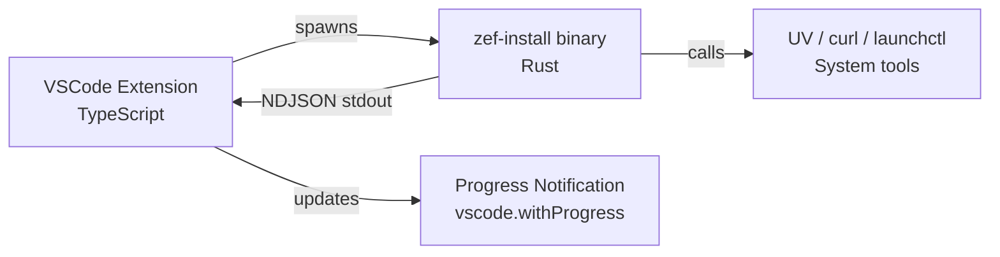
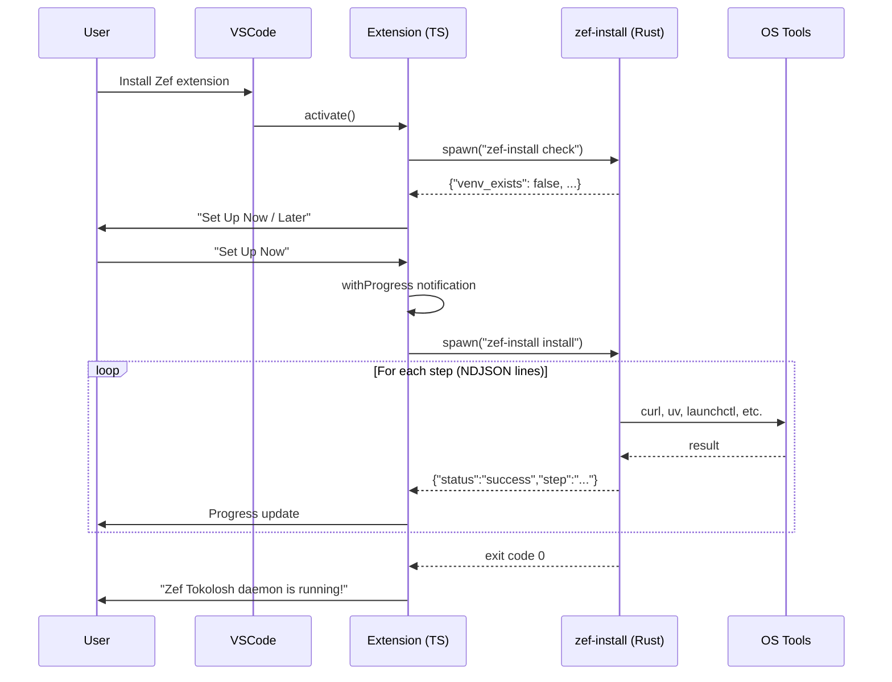

# VSCode Extension → zef-installer Integration

How to use the `zef-installer` Rust binary to install the Zef Tokolosh daemon from within the VSCode extension — without reimplementing any installer logic in TypeScript.

---

## Goal

When the extension **activates** (not during install — VSCode extensions cannot prompt during marketplace installation), it should:
1. Detect whether the Tokolosh daemon is already set up
2. If not, prompt the user to install
3. Run the full 7-step installation (UV → venv → wheel → daemon → service)
4. Show progress in a VSCode notification

> [!important]
> VSCode extension installation is a **passive process** — the marketplace downloads and unpacks the VSIX. There is no install-time hook. All user interaction happens at **activation time**, which is when the extension's `activate()` function runs. This is triggered by events like opening a `.zef` file, running a Zef command, or on workspace open (if configured in `activationEvents`).

All installation logic lives in `zef-installer` (Rust). The extension just needs to **run the binary and parse its JSON output**.

---

## Architecture



The `zef-install` binary already outputs NDJSON (one JSON object per line):

```json
{"status":"success","step":"ensure_uv","message":"UV available at /Users/ulf/.local/bin/uv"}
{"status":"success","step":"create_venv","message":"Created venv at /Users/ulf/Library/..."}
{"status":"success","step":"download_wheel","message":"Downloaded to /tmp/zef_core-..."}
{"status":"success","step":"install_wheel","message":"Zef installed into venv"}
{"status":"success","step":"write_daemon","message":"Wrote daemon to ..."}
{"status":"success","step":"create_service","message":"Created service at ..."}
{"status":"success","step":"start_service","message":"Tokolosh service started"}
```

The extension just needs to **spawn this binary** and **read lines** from stdout.

---

## What the Old Tutorials Got Right

The two existing tutorials (`vscode-extension-install-tutorial.md` and `cross-platform-installer-tutorial.md`) correctly identified:

- The 7-step installation flow
- Platform detection strategy
- The `withProgress` notification pattern
- WSL considerations on Windows
- Checking for existing installations

> [!important]
> **What they got wrong**: They proposed reimplementing all 7 steps in TypeScript. This is 500+ lines of duplicated logic that must stay in sync with the Rust installer. The correct approach is to **delegate to the compiled binary**.

---

## Three Approaches Evaluated

### Option A: Bundle Binary in Platform-Specific VSIX ⭐ Recommended

Bundle the pre-compiled `zef-install` binary inside the extension's VSIX package. Use VSCode's platform-specific extension support to include only the correct binary per platform.

```
resources/
└── bin/
    └── zef-install          # Platform-specific binary (only one per VSIX)
```

**Build pipeline**: `vsce package --target darwin-arm64` includes only the macOS ARM binary, `--target linux-x64` includes only the Linux binary, etc.

| Criterion | Rating |
|-----------|--------|
| **Setup complexity** | Low — just copy a binary into resources/ |
| **Runtime reliability** | High — no download, no network needed at install time |
| **Extension size impact** | +1MB per platform (trivial vs current 8.2MB) |
| **Maintenance** | Rebuild zef-installer → rebuild VSIX |
| **Offline support** | Binary works offline (but wheel download still needs network) |
| **Platform coverage** | macOS ARM (today), Linux x64, Windows x64 — matches current Makefile |

### Option B: Download Binary on First Use

Don't bundle the binary. Instead, download it from GitHub Releases on first activation.

| Criterion | Rating |
|-----------|--------|
| **Setup complexity** | Medium — need GitHub release pipeline + download logic |
| **Runtime reliability** | Lower — depends on GitHub being reachable |
| **Extension size impact** | Zero (binary not in VSIX) |
| **Maintenance** | Can update binary independently of extension version |
| **Offline support** | Fails if user is offline |
| **Platform coverage** | Flexible — can add platforms without rebuilding extension |

### Option C: Reimplement in TypeScript

Port all 7 steps to TypeScript using `child_process.exec` for shell commands.

| Criterion | Rating |
|-----------|--------|
| **Setup complexity** | High — 500+ lines of new TS code |
| **Runtime reliability** | Medium — shell command parsing, path quoting, platform edge cases |
| **Extension size impact** | Zero (no binary, just TS code) |
| **Maintenance** | Must keep two implementations in sync (Rust + TS) |
| **Offline support** | Same (needs network for UV + wheel) |
| **Platform coverage** | Good, but must re-handle every platform edge case (WSL, systemd, etc.) |

### Verdict

> [!tip] Recommendation
> **Option A (Bundle Binary)** is the clear winner:
> - Zero new installer logic in TypeScript
> - ~1MB per platform is negligible
> - VSCode natively supports platform-specific VSIX packaging
> - Single source of truth for installation (the Rust crate)
> - Already have cross-compilation working via `make all` (Makefile + cargo-zigbuild + zig)

---

## Implementation Plan

### Step 1: Build Platform-Specific Binaries

The existing Makefile already produces all three binaries:

```bash
cd zef-installer && make all
# Produces:
#   dist/zef-install-macos-arm64       (1.0MB)
#   dist/zef-install-linux-x86_64      (993KB)
#   dist/zef-install-windows-x86_64.exe (1.6MB)
```

### Step 2: Add Binary to Extension Resources

Create a build script that copies the correct binary based on target platform:

```bash
# For macOS ARM64 VSIX:
cp dist/zef-install-macos-arm64 resources/bin/zef-install
chmod +x resources/bin/zef-install

# For Linux x64 VSIX:
cp dist/zef-install-linux-x86_64 resources/bin/zef-install
chmod +x resources/bin/zef-install

# For Windows x64 VSIX:
cp dist/zef-install-windows-x86_64.exe resources/bin/zef-install.exe
```

### Step 3: Update `.vscodeignore`

Ensure the binary IS included in the VSIX:

```
# Do NOT ignore:
# resources/bin/
```

### Step 4: TypeScript Integration

#### 4a. Installer module (`src/installer.ts`)

```typescript
import { spawn } from 'child_process';
import * as readline from 'readline';
import * as vscode from 'vscode';
import * as path from 'path';
import * as fs from 'fs';

interface StepResult {
    status: 'success' | 'failed' | 'skipped';
    step: string;
    message?: string;
    error?: string;
    reason?: string;
}

interface InstallStatus {
    platform: string;
    uv_installed: boolean;
    uv_path: string | null;
    venv_exists: boolean;
    venv_path: string;
}

function getInstallerPath(context: vscode.ExtensionContext): string {
    const ext = process.platform === 'win32' ? '.exe' : '';
    return path.join(context.extensionPath, 'resources', 'bin', `zef-install${ext}`);
}

/**
 * Check the current installation status.
 * Runs: zef-install check
 */
export async function checkInstallation(
    context: vscode.ExtensionContext
): Promise<InstallStatus | null> {
    const bin = getInstallerPath(context);
    if (!fs.existsSync(bin)) { return null; }

    return new Promise((resolve) => {
        const proc = spawn(bin, ['check']);
        let stdout = '';

        proc.stdout.on('data', (data) => { stdout += data.toString(); });
        proc.on('close', (code) => {
            if (code === 0) {
                try { resolve(JSON.parse(stdout)); }
                catch { resolve(null); }
            } else {
                resolve(null);
            }
        });
        proc.on('error', () => resolve(null));
    });
}

/**
 * Run the full installation with progress reporting.
 * Runs: zef-install install
 * Reads NDJSON from stdout, updates VSCode progress notification.
 */
export async function runInstallation(
    context: vscode.ExtensionContext
): Promise<boolean> {
    const bin = getInstallerPath(context);

    return vscode.window.withProgress(
        {
            location: vscode.ProgressLocation.Notification,
            title: 'Setting up Zef',
            cancellable: false,
        },
        async (progress) => {
            return new Promise<boolean>((resolve) => {
                const proc = spawn(bin, ['install']);

                const rl = readline.createInterface({ input: proc.stdout });

                const stepNames: Record<string, string> = {
                    check_wsl: 'Checking WSL...',
                    ensure_uv: 'Step 1/7: Setting up UV...',
                    create_venv: 'Step 2/7: Creating Python environment...',
                    download_wheel: 'Step 3/7: Downloading Zef...',
                    install_wheel: 'Step 4/7: Installing Zef...',
                    write_daemon: 'Step 5/7: Writing daemon...',
                    create_service: 'Step 6/7: Creating service...',
                    start_service: 'Step 7/7: Starting Tokolosh...',
                };

                let stepCount = 0;
                const increment = 100 / 7;

                rl.on('line', (line) => {
                    try {
                        const result: StepResult = JSON.parse(line);
                        const label = stepNames[result.step] || result.step;

                        if (result.status === 'success') {
                            stepCount++;
                            progress.report({
                                message: `${label} ✓`,
                                increment,
                            });
                        } else if (result.status === 'failed') {
                            vscode.window.showErrorMessage(
                                `Zef setup failed at ${result.step}: ${result.error}`
                            );
                        }
                        // 'skipped' — silently continue
                    } catch {
                        // Non-JSON line (e.g., error output) — ignore
                    }
                });

                proc.on('close', (code) => {
                    if (code === 0) {
                        vscode.window.showInformationMessage(
                            'Zef Tokolosh daemon is running!'
                        );
                        resolve(true);
                    } else {
                        resolve(false);
                    }
                });

                proc.on('error', (err) => {
                    vscode.window.showErrorMessage(
                        `Failed to run installer: ${err.message}`
                    );
                    resolve(false);
                });
            });
        }
    );
}
```

#### 4b. Integration in `extension.ts` activate()

The check and prompt happen here — **at activation time**, not at install time. VSCode has no install-time hooks for user interaction.

```typescript
import { checkInstallation, runInstallation } from './installer';

export async function activate(context: vscode.ExtensionContext) {
    // ... existing activation code ...

    // Check if Zef environment is set up
    const status = await checkInstallation(context);

    if (!status || !status.venv_exists) {
        const choice = await vscode.window.showInformationMessage(
            'Zef needs to set up a local environment (one-time setup).',
            'Set Up Now',
            'Later'
        );

        if (choice === 'Set Up Now') {
            await runInstallation(context);
        }
    }
}
```

> [!note]
> The `activate()` function runs when VSCode loads the extension, governed by `activationEvents` in `package.json`. Current activation events include `onLanguage:zef`, `onCommand:zef.*`, etc. To ensure the daemon check runs early, `onStartupFinished` can be added — though this means the extension loads on every VSCode startup.

### Step 5: Platform-Specific VSIX Packaging

#### Update `build.py` (or create a new build script):

```python
import subprocess
import shutil
import os

PLATFORMS = {
    'darwin-arm64':  'zef-install-macos-arm64',
    'linux-x64':     'zef-install-linux-x86_64',
    'win32-x64':     'zef-install-windows-x86_64.exe',
}

INSTALLER_DIST = '../zef-installer/dist'
RESOURCES_BIN  = 'resources/bin'

def build_vsix(target: str):
    """Build a platform-specific VSIX."""
    binary_name = PLATFORMS[target]
    src = os.path.join(INSTALLER_DIST, binary_name)
    
    # Create resources/bin/
    os.makedirs(RESOURCES_BIN, exist_ok=True)
    
    # Copy binary with correct name
    ext = '.exe' if 'win32' in target else ''
    dst = os.path.join(RESOURCES_BIN, f'zef-install{ext}')
    shutil.copy2(src, dst)
    
    if not ext:
        os.chmod(dst, 0o755)
    
    # Package VSIX for this target
    subprocess.run(['npx', 'vsce', 'package', '--target', target], check=True)
    
    # Clean up binary
    os.remove(dst)

def build_all():
    """Build platform-specific VSIXs for all supported platforms."""
    # First, build all installer binaries
    subprocess.run(['make', '-C', '../zef-installer', 'all'], check=True)
    
    for target in PLATFORMS:
        print(f'\n=== Building VSIX for {target} ===')
        build_vsix(target)

if __name__ == '__main__':
    build_all()
```

### Step 6: Verify the Binary is in the VSIX

```bash
# Package a test VSIX
npx vsce package --target darwin-arm64

# Inspect contents
unzip -l zef-darwin-arm64-0.1.16.vsix | grep zef-install
# Should show: resources/bin/zef-install
```

---

## Data Flow



---

## What the Old Tutorials Covered That Is Now Irrelevant

| Topic | Old Tutorial | Status |
|-------|-------------|--------|
| TypeScript `findUv()` / `ensureUvInstalled()` | vscode-extension-install-tutorial.md | ❌ Replaced by binary |
| TypeScript `createVenv()` | vscode-extension-install-tutorial.md | ❌ Replaced by binary |
| TypeScript `downloadWheel()` with curl | vscode-extension-install-tutorial.md | ❌ Replaced by binary |
| TypeScript `installWheel()` | vscode-extension-install-tutorial.md | ❌ Replaced by binary |
| TypeScript `writeDaemonScript()` with embedded string | vscode-extension-install-tutorial.md | ❌ Replaced by binary |
| TypeScript `createLaunchdPlist()` | vscode-extension-install-tutorial.md | ❌ Replaced by binary |
| TypeScript `startService()` | vscode-extension-install-tutorial.md | ❌ Replaced by binary |
| Platform installer interface (macos.ts, linux.ts, windows.ts) | cross-platform-installer-tutorial.md | ❌ Replaced by binary |
| `wslExec()` wrapper | cross-platform-installer-tutorial.md | ❌ Handled by binary |
| WSL path translation | cross-platform-installer-tutorial.md | ❌ Handled by binary |

### What IS Still Relevant

| Topic | Why It Still Applies |
|-------|---------------------|
| `withProgress` notification pattern | How the extension shows status to the user |
| Activation-time check vs lazy check | When to trigger the installer |
| Checking `getDefaultVenvPath()` for existing install | Quick check before spawning binary |
| `configManager.ts` fallback to Zef Python | The extension should use the installed Python |
| `pythonDetector.ts` detecting Zef venv | Discovery of the Zef-managed Python |
| Port 27021 for Tokolosh WebSocket | Connection after installation |

---

## Platform-Specific VSIX Targets

| Platform | VSIX Target | zef-install Binary | Status |
|----------|-------------|-------------------|--------|
| macOS ARM64 | `darwin-arm64` | `zef-install-macos-arm64` | ✅ Built |
| macOS Intel | `darwin-x64` | Not yet cross-compiled | ⚠️ Need to add target |
| Linux x64 | `linux-x64` | `zef-install-linux-x86_64` | ✅ Built |
| Linux ARM64 | `linux-arm64` | Not yet cross-compiled | ⚠️ Need to add target |
| Windows x64 | `win32-x64` | `zef-install-windows-x86_64.exe` | ✅ Built |
| Windows ARM64 | `win32-arm64` | Not yet cross-compiled | ⚠️ Future |

> [!note]
> If a user installs the **universal** (non-platform-specific) VSIX, the binary won't be present. The extension should handle this gracefully by falling back to showing a manual installation guide or offering to download the binary.

---

## Binary Sizes (Current)

| Binary | Size | Notes |
|--------|------|-------|
| `zef-install-macos-arm64` | 1.0 MB | Native build |
| `zef-install-linux-x86_64` | 993 KB | Cross-compiled via zig |
| `zef-install-windows-x86_64.exe` | 1.6 MB | Cross-compiled via zig |
| Current VSIX (no binary) | 8.2 MB | Includes Excalidraw, Svelte, etc. |
| **VSIX + binary** | **~9.2 MB** | **+12% size increase** |

This is well within VSCode's extension size limits and negligible for users.

---

## Checklist for Implementation

- [ ] Build all 3 installer binaries: `cd zef-installer && make all`
- [ ] Create `resources/bin/` directory in extension
- [ ] Write `src/installer.ts` — spawn binary, parse NDJSON, update progress
- [ ] Add `checkInstallation()` call in `activate()` in `extension.ts`
- [ ] Update `.vscodeignore` to NOT ignore `resources/bin/`
- [ ] Update `build.py` to copy correct binary per target and run `vsce package --target`
- [ ] Test on macOS: `vsce package --target darwin-arm64` → install → verify installer runs
- [ ] Test on Linux: `vsce package --target linux-x64` → deploy to server → verify
- [ ] Commit changes to zef-vscode-extension
