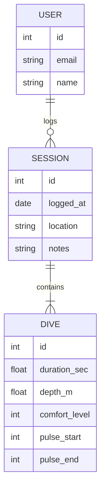
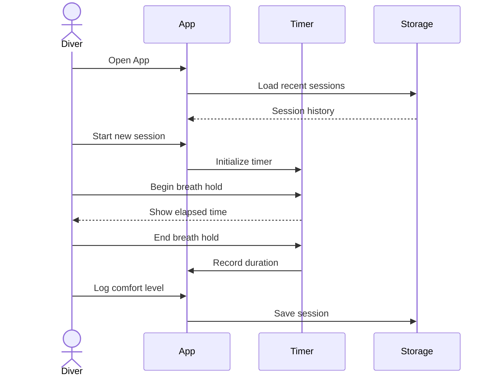

# Overdive 🌊

**Strava for Free Diving** — Track your breath holds, depths, and progress over time.

---

## Vision

Overdive helps freedivers log and analyze their training. Whether you're practicing static apnea (STA), dynamic apnea, or depth training, Overdive gives you the insights you need to improve safely.

---

## Core Features

| Feature | Description | Priority |
|---------|-------------|----------|
| **Session Logging** | Record breath holds, depths, times | P0 |
| **STA Timer** | Built-in static apnea timer with contractions | P0 |
| **Progress Charts** | Visualize improvements over weeks/months | P1 |
| **Heart Rate** | Integrate with HR monitors for bradycardia tracking | P2 |
| **Safety Score** | Comfort level and warning indicators | P1 |

---

## Architecture Overview

```mermaid
flowchart TB
    subgraph Client
        A[Mobile App] --> B[Svelte Components]
        B --> C[Local Storage]
    end
    
    subgraph Backend
        D[API Server] --> E[PostgreSQL]
        D --> F[Auth Service]
    end
    
    C <-->|Sync| D
    
    style A fill:#1e3a5f,stroke:#4a9eff
    style D fill:#2d4a3e,stroke:#34d399
```



---

## Data Model



---

## Component Library

Below are the core UI components for Overdive, designed with a sleek dark aesthetic.

### Stat Card

Display a single metric with label and trend indicator:

```svelte
<script>
  export let label = "Max Breath Hold";
  export let value = "4:32";
  export let trend = "+12s";
  export let trendUp = true;
</script>

<div class="stat-card">
  <div class="label">{label}</div>
  <div class="value">{value}</div>
  <div class="trend" class:up={trendUp} class:down={!trendUp}>
    {trendUp ? '↑' : '↓'} {trend}
  </div>
</div>

<style>
  .stat-card {
    background: linear-gradient(135deg, #0f172a 0%, #1e293b 100%);
    border: 1px solid #334155;
    border-radius: 12px;
    padding: 20px;
    min-width: 160px;
  }
  .label {
    font-size: 12px;
    color: #94a3b8;
    text-transform: uppercase;
    letter-spacing: 0.1em;
    margin-bottom: 8px;
  }
  .value {
    font-size: 32px;
    font-weight: 600;
    color: #f1f5f9;
    font-family: 'SF Mono', monospace;
  }
  .trend {
    font-size: 13px;
    margin-top: 8px;
  }
  .trend.up { color: #34d399; }
  .trend.down { color: #f87171; }
</style>
```

---

### Comfort Level Selector

Rate how a dive felt (1-5 scale with visual feedback):

```svelte
<script>
  let comfort = 3;
  const levels = [
    { value: 1, label: 'Struggled', emoji: '😰' },
    { value: 2, label: 'Tough', emoji: '😤' },
    { value: 3, label: 'Okay', emoji: '😐' },
    { value: 4, label: 'Good', emoji: '😊' },
    { value: 5, label: 'Easy', emoji: '😎' }
  ];
</script>

<div class="comfort-selector">
  <div class="title">Comfort Level</div>
  <div class="levels">
    {#each levels as level}
      <button 
        class="level" 
        class:selected={comfort === level.value}
        on:click={() => comfort = level.value}
      >
        <span class="emoji">{level.emoji}</span>
        <span class="label">{level.label}</span>
      </button>
    {/each}
  </div>
</div>

<style>
  .comfort-selector {
    background: #0f172a;
    border: 1px solid #334155;
    border-radius: 12px;
    padding: 20px;
  }
  .title {
    font-size: 14px;
    color: #94a3b8;
    margin-bottom: 16px;
  }
  .levels {
    display: flex;
    gap: 8px;
  }
  .level {
    flex: 1;
    display: flex;
    flex-direction: column;
    align-items: center;
    gap: 6px;
    padding: 12px 8px;
    background: #1e293b;
    border: 1px solid #334155;
    border-radius: 8px;
    cursor: pointer;
    transition: all 0.2s;
  }
  .level:hover {
    background: #334155;
    border-color: #475569;
  }
  .level.selected {
    background: #1e3a5f;
    border-color: #3b82f6;
  }
  .emoji { font-size: 24px; }
  .label { 
    font-size: 11px; 
    color: #94a3b8;
    text-transform: uppercase;
    letter-spacing: 0.05em;
  }
  .level.selected .label { color: #93c5fd; }
</style>
```

---

### Timer Display

A large countdown/stopwatch display for STA practice:

```svelte
<script>
  let seconds = 185; // 3:05
  let running = false;
  let interval;
  
  function toggle() {
    if (running) {
      clearInterval(interval);
      running = false;
    } else {
      running = true;
      interval = setInterval(() => seconds++, 1000);
    }
  }
  
  function reset() {
    clearInterval(interval);
    running = false;
    seconds = 0;
  }
  
  $: minutes = Math.floor(seconds / 60);
  $: secs = seconds % 60;
  $: display = `${minutes}:${secs.toString().padStart(2, '0')}`;
</script>

<div class="timer">
  <div class="display">{display}</div>
  <div class="controls">
    <button class="btn" class:running on:click={toggle}>
      {running ? '⏸ Pause' : '▶ Start'}
    </button>
    <button class="btn secondary" on:click={reset}>↺ Reset</button>
  </div>
</div>

<style>
  .timer {
    background: linear-gradient(180deg, #0c1222 0%, #0f172a 100%);
    border: 1px solid #334155;
    border-radius: 16px;
    padding: 32px;
    text-align: center;
  }
  .display {
    font-size: 72px;
    font-weight: 200;
    font-family: 'SF Mono', 'Menlo', monospace;
    color: #f1f5f9;
    letter-spacing: 0.05em;
    margin-bottom: 24px;
  }
  .controls {
    display: flex;
    gap: 12px;
    justify-content: center;
  }
  .btn {
    padding: 12px 24px;
    font-size: 14px;
    font-weight: 500;
    border-radius: 8px;
    cursor: pointer;
    transition: all 0.2s;
    border: none;
    background: #3b82f6;
    color: white;
  }
  .btn:hover { background: #2563eb; }
  .btn.running {
    background: #f59e0b;
  }
  .btn.running:hover { background: #d97706; }
  .btn.secondary {
    background: #334155;
    color: #94a3b8;
  }
  .btn.secondary:hover { background: #475569; }
</style>
```

---

### Session Entry Row

A compact row showing a past session with key metrics:

```svelte
<script>
  const sessions = [
    { date: 'Today', location: 'Pool Training', maxTime: '4:45', dives: 8, comfort: 4 },
    { date: 'Yesterday', location: 'Ocean - Blue Hole', maxTime: '3:52', dives: 5, comfort: 3 },
    { date: 'Jan 15', location: 'Pool Training', maxTime: '4:32', dives: 12, comfort: 5 }
  ];
  
  const comfortEmoji = { 1: '😰', 2: '😤', 3: '😐', 4: '😊', 5: '😎' };
</script>

<div class="session-list">
  {#each sessions as session}
    <div class="session-row">
      <div class="left">
        <div class="date">{session.date}</div>
        <div class="location">{session.location}</div>
      </div>
      <div class="metrics">
        <div class="metric">
          <span class="value">{session.maxTime}</span>
          <span class="label">max</span>
        </div>
        <div class="metric">
          <span class="value">{session.dives}</span>
          <span class="label">dives</span>
        </div>
        <div class="comfort">{comfortEmoji[session.comfort]}</div>
      </div>
    </div>
  {/each}
</div>

<style>
  .session-list {
    background: #0f172a;
    border: 1px solid #334155;
    border-radius: 12px;
    overflow: hidden;
  }
  .session-row {
    display: flex;
    justify-content: space-between;
    align-items: center;
    padding: 16px 20px;
    border-bottom: 1px solid #1e293b;
    cursor: pointer;
    transition: background 0.15s;
  }
  .session-row:hover { background: #1e293b; }
  .session-row:last-child { border-bottom: none; }
  
  .left { display: flex; flex-direction: column; gap: 4px; }
  .date { font-size: 15px; color: #f1f5f9; font-weight: 500; }
  .location { font-size: 13px; color: #64748b; }
  
  .metrics { display: flex; align-items: center; gap: 20px; }
  .metric { display: flex; flex-direction: column; align-items: center; gap: 2px; }
  .metric .value { font-size: 15px; color: #f1f5f9; font-family: monospace; }
  .metric .label { font-size: 10px; color: #64748b; text-transform: uppercase; }
  .comfort { font-size: 20px; }
</style>
```

---

## User Flow



---

## Roadmap

### Phase 1: MVP
- [ ] Session logging with basic stats
- [ ] STA timer with contractions marker
- [ ] Simple history view

### Phase 2: Insights
- [ ] Weekly/monthly progress charts
- [ ] Personal best tracking
- [ ] Export to CSV

### Phase 3: Social
- [ ] Share sessions with training partners
- [ ] Leaderboards (opt-in)
- [ ] Training groups

---

> *"The sea, once it casts its spell, holds one in its net of wonder forever."* — Jacques Cousteau

---

*Built with Zef — where documentation meets code.*
