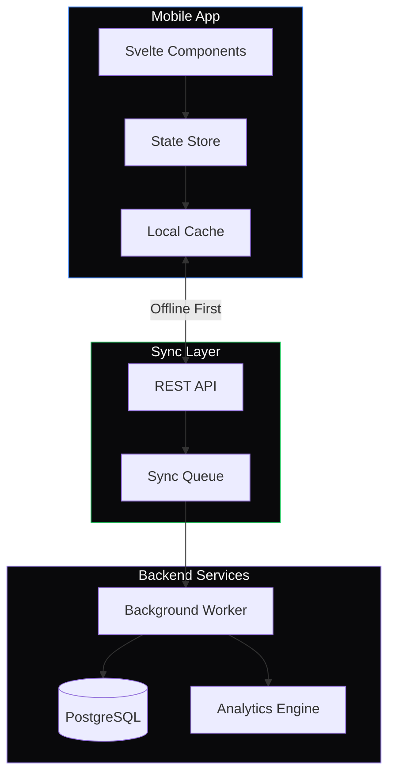

# Overdive 2.0 🌊

**The Freediver's Companion** — Track. Analyze. Transcend.

---

## Philosophy

Overdive is built for freedivers who understand that progress happens in silence. Every breath hold tells a story. Every meter of depth is earned through presence, not force.

Whether you're pushing your static apnea limits, exploring dynamic distances, or descending into the blue, Overdive captures the data that matters — so you can focus on the dive.

---

## Component Showcase

Below are 10 meticulously crafted UI components. Each embodies the Overdive design ethos: **dark, minimal, breathing space, maximum clarity.**

---

### 1. Hero Metric Card

A bold, centered display for your primary achievement:

```svelte
<script>
  let metric = $state({
    value: "5:42",
    label: "Personal Best",
    subtitle: "Static Apnea",
    achievedAt: "Dec 28, 2025"
  });
</script>

<div class="hero-card">
  <div class="glow"></div>
  <span class="subtitle">{metric.subtitle}</span>
  <div class="value">{metric.value}</div>
  <span class="label">{metric.label}</span>
  <span class="date">{metric.achievedAt}</span>
</div>

<style>
  .hero-card {
    position: relative;
    background: #09090b;
    border: 1px solid rgba(255, 255, 255, 0.06);
    border-radius: 24px;
    padding: 48px 64px;
    text-align: center;
    overflow: hidden;
  }
  .glow {
    position: absolute;
    top: -50%;
    left: 50%;
    transform: translateX(-50%);
    width: 200px;
    height: 200px;
    background: radial-gradient(circle, rgba(59, 130, 246, 0.15) 0%, transparent 70%);
    pointer-events: none;
  }
  .subtitle {
    font-size: 11px;
    font-weight: 500;
    letter-spacing: 0.2em;
    text-transform: uppercase;
    color: #3b82f6;
  }
  .value {
    font-size: 80px;
    font-weight: 200;
    font-family: 'SF Pro Display', -apple-system, sans-serif;
    color: #fafafa;
    letter-spacing: -0.02em;
    line-height: 1;
    margin: 16px 0;
  }
  .label {
    display: block;
    font-size: 14px;
    font-weight: 500;
    color: #71717a;
    margin-bottom: 8px;
  }
  .date {
    font-size: 12px;
    color: #52525b;
  }
</style>
```

---

### 2. Breath Phase Indicator

Visual feedback during a breath hold showing current phase:

```svelte
<script>
  let phase = $state("relax");
  let phases = [
    { id: "breathe", label: "Breathe Up", icon: "○" },
    { id: "hold", label: "Final Breath", icon: "●" },
    { id: "relax", label: "Relaxation", icon: "◐" },
    { id: "struggle", label: "Contractions", icon: "◉" }
  ];
</script>

<div class="phase-indicator">
  {#each phases as p}
    <div class="phase" class:active={phase === p.id}>
      <span class="icon">{p.icon}</span>
      <span class="name">{p.label}</span>
    </div>
  {/each}
</div>

<style>
  .phase-indicator {
    display: flex;
    gap: 2px;
    background: #09090b;
    border-radius: 16px;
    padding: 6px;
    border: 1px solid rgba(255, 255, 255, 0.04);
  }
  .phase {
    flex: 1;
    display: flex;
    flex-direction: column;
    align-items: center;
    gap: 8px;
    padding: 20px 16px;
    border-radius: 12px;
    background: transparent;
    transition: all 0.3s cubic-bezier(0.4, 0, 0.2, 1);
    cursor: pointer;
  }
  .phase:hover {
    background: rgba(255, 255, 255, 0.02);
  }
  .phase.active {
    background: linear-gradient(180deg, rgba(59, 130, 246, 0.12) 0%, rgba(59, 130, 246, 0.04) 100%);
  }
  .icon {
    font-size: 20px;
    color: #52525b;
    transition: color 0.3s;
  }
  .phase.active .icon {
    color: #3b82f6;
  }
  .name {
    font-size: 11px;
    font-weight: 500;
    letter-spacing: 0.05em;
    text-transform: uppercase;
    color: #52525b;
    transition: color 0.3s;
  }
  .phase.active .name {
    color: #a1a1aa;
  }
</style>
```

---

### 3. Depth Gauge

A vertical depth visualization with current position:

```svelte
<script>
  let currentDepth = $state(32);
  let maxDepth = $state(45);
  let targetDepth = $state(40);
  
  let percentage = $derived((currentDepth / maxDepth) * 100);
</script>

<div class="depth-gauge">
  <div class="scale">
    <div class="fill" style="height: {percentage}%">
      <div class="current-marker">
        <span class="depth-value">{currentDepth}m</span>
      </div>
    </div>
    <div class="target-line" style="bottom: {(targetDepth / maxDepth) * 100}%">
      <span class="target-label">Target {targetDepth}m</span>
    </div>
  </div>
  <div class="labels">
    <span class="surface">Surface</span>
    <span class="max">{maxDepth}m</span>
  </div>
</div>

<style>
  .depth-gauge {
    display: flex;
    gap: 16px;
    padding: 24px;
    background: #09090b;
    border: 1px solid rgba(255, 255, 255, 0.04);
    border-radius: 20px;
    height: 320px;
  }
  .scale {
    position: relative;
    width: 48px;
    background: linear-gradient(180deg, #0c4a6e 0%, #0369a1 50%, #0284c7 100%);
    border-radius: 24px;
    overflow: hidden;
  }
  .fill {
    position: absolute;
    bottom: 0;
    left: 0;
    right: 0;
    background: linear-gradient(180deg, #1e3a5f 0%, #172554 100%);
    transition: height 0.6s cubic-bezier(0.4, 0, 0.2, 1);
  }
  .current-marker {
    position: absolute;
    top: 0;
    left: 50%;
    transform: translate(-50%, -50%);
    background: #fafafa;
    color: #09090b;
    padding: 6px 12px;
    border-radius: 20px;
    font-size: 13px;
    font-weight: 600;
    white-space: nowrap;
    box-shadow: 0 4px 12px rgba(0, 0, 0, 0.4);
  }
  .target-line {
    position: absolute;
    left: -8px;
    right: -8px;
    height: 2px;
    background: rgba(251, 191, 36, 0.6);
  }
  .target-label {
    position: absolute;
    left: 60px;
    top: 50%;
    transform: translateY(-50%);
    font-size: 11px;
    color: #fbbf24;
    white-space: nowrap;
  }
  .labels {
    display: flex;
    flex-direction: column;
    justify-content: space-between;
    padding: 4px 0;
  }
  .surface, .max {
    font-size: 11px;
    font-weight: 500;
    color: #52525b;
    letter-spacing: 0.05em;
    text-transform: uppercase;
  }
</style>
```

---

### 4. Training Partner Card

An elegant card showing a training buddy with invite capability:

```svelte
<script>
  let partner = $state({
    name: "Maya Chen",
    avatar: null,
    role: "Safety Buddy",
    lastSession: "2 days ago",
    sessionsShared: 24
  });
  
  let initials = $derived(partner.name.split(' ').map(n => n[0]).join(''));
</script>

<div class="partner-card">
  <div class="partner-info">
    <div class="avatar">
      {#if partner.avatar}
        
      {:else}
        <span class="initials">{initials}</span>
      {/if}
      <div class="status-dot"></div>
    </div>
    <div class="details">
      <h3 class="name">{partner.name}</h3>
      <span class="role">{partner.role}</span>
    </div>
  </div>
  <div class="stats">
    <div class="stat">
      <span class="stat-value">{partner.sessionsShared}</span>
      <span class="stat-label">Sessions</span>
    </div>
    <div class="divider"></div>
    <div class="stat">
      <span class="stat-value">{partner.lastSession}</span>
      <span class="stat-label">Last Active</span>
    </div>
  </div>
  <button class="invite-btn">
    <span class="plus">+</span>
    Invite to Session
  </button>
</div>

<style>
  .partner-card {
    background: #09090b;
    border: 1px solid rgba(255, 255, 255, 0.06);
    border-radius: 20px;
    padding: 24px;
    display: flex;
    flex-direction: column;
    gap: 24px;
  }
  .partner-info {
    display: flex;
    align-items: center;
    gap: 16px;
  }
  .avatar {
    position: relative;
    width: 56px;
    height: 56px;
    border-radius: 50%;
    background: linear-gradient(135deg, #3b82f6 0%, #1d4ed8 100%);
    display: grid;
    place-items: center;
    overflow: hidden;
  }
  .avatar img {
    width: 100%;
    height: 100%;
    object-fit: cover;
  }
  .initials {
    font-size: 18px;
    font-weight: 600;
    color: #fafafa;
  }
  .status-dot {
    position: absolute;
    bottom: 2px;
    right: 2px;
    width: 14px;
    height: 14px;
    background: #22c55e;
    border: 3px solid #09090b;
    border-radius: 50%;
  }
  .details {
    display: flex;
    flex-direction: column;
    gap: 4px;
  }
  .name {
    margin: 0;
    font-size: 17px;
    font-weight: 600;
    color: #fafafa;
  }
  .role {
    font-size: 13px;
    color: #71717a;
  }
  .stats {
    display: flex;
    align-items: center;
    gap: 20px;
    padding: 16px;
    background: rgba(255, 255, 255, 0.02);
    border-radius: 12px;
  }
  .stat {
    flex: 1;
    display: flex;
    flex-direction: column;
    gap: 4px;
  }
  .stat-value {
    font-size: 15px;
    font-weight: 500;
    color: #e4e4e7;
  }
  .stat-label {
    font-size: 11px;
    color: #52525b;
    text-transform: uppercase;
    letter-spacing: 0.05em;
  }
  .divider {
    width: 1px;
    height: 32px;
    background: rgba(255, 255, 255, 0.06);
  }
  .invite-btn {
    display: flex;
    align-items: center;
    justify-content: center;
    gap: 8px;
    padding: 14px 20px;
    background: transparent;
    border: 1px solid rgba(255, 255, 255, 0.1);
    border-radius: 12px;
    color: #a1a1aa;
    font-size: 14px;
    font-weight: 500;
    cursor: pointer;
    transition: all 0.2s;
  }
  .invite-btn:hover {
    background: rgba(255, 255, 255, 0.04);
    border-color: rgba(255, 255, 255, 0.15);
    color: #fafafa;
  }
  .plus {
    font-size: 18px;
    font-weight: 300;
  }
</style>
```

---

### 5. Session Timeline

A minimal timeline showing dive attempts within a session:

```svelte
<script>
  let dives = $state([
    { id: 1, time: "09:15", duration: "2:45", depth: null, type: "STA", comfort: 4 },
    { id: 2, time: "09:32", duration: "3:12", depth: null, type: "STA", comfort: 3 },
    { id: 3, time: "09:48", duration: "3:48", depth: null, type: "STA", comfort: 4 },
    { id: 4, time: "10:05", duration: "4:02", depth: null, type: "STA", comfort: 5 }
  ]);
  
  let comfortColors = {
    1: "#ef4444", 2: "#f97316", 3: "#eab308", 4: "#22c55e", 5: "#10b981"
  };
</script>

<div class="timeline">
  <div class="header">
    <h3>Session Timeline</h3>
    <span class="count">{dives.length} dives</span>
  </div>
  <div class="dives">
    {#each dives as dive, i}
      <div class="dive-row">
        <div class="time-col">
          <span class="time">{dive.time}</span>
          {#if i < dives.length - 1}
            <div class="connector"></div>
          {/if}
        </div>
        <div class="dive-card">
          <div class="dive-main">
            <span class="duration">{dive.duration}</span>
            <span class="type">{dive.type}</span>
          </div>
          <div class="comfort-dot" style="background: {comfortColors[dive.comfort]}"></div>
        </div>
      </div>
    {/each}
  </div>
</div>

<style>
  .timeline {
    background: #09090b;
    border: 1px solid rgba(255, 255, 255, 0.04);
    border-radius: 20px;
    padding: 24px;
  }
  .header {
    display: flex;
    justify-content: space-between;
    align-items: center;
    margin-bottom: 24px;
  }
  .header h3 {
    margin: 0;
    font-size: 15px;
    font-weight: 600;
    color: #fafafa;
  }
  .count {
    font-size: 12px;
    color: #52525b;
  }
  .dives {
    display: flex;
    flex-direction: column;
    gap: 0;
  }
  .dive-row {
    display: flex;
    gap: 20px;
  }
  .time-col {
    display: flex;
    flex-direction: column;
    align-items: center;
    width: 48px;
  }
  .time {
    font-size: 12px;
    font-family: 'SF Mono', monospace;
    color: #52525b;
    padding: 4px 0;
  }
  .connector {
    flex: 1;
    width: 1px;
    background: linear-gradient(180deg, rgba(255,255,255,0.08) 0%, transparent 100%);
    min-height: 24px;
  }
  .dive-card {
    flex: 1;
    display: flex;
    justify-content: space-between;
    align-items: center;
    padding: 16px 20px;
    background: rgba(255, 255, 255, 0.02);
    border-radius: 12px;
    margin-bottom: 12px;
    border: 1px solid rgba(255, 255, 255, 0.03);
    transition: all 0.2s;
  }
  .dive-card:hover {
    background: rgba(255, 255, 255, 0.04);
    border-color: rgba(255, 255, 255, 0.06);
  }
  .dive-main {
    display: flex;
    align-items: baseline;
    gap: 12px;
  }
  .duration {
    font-size: 20px;
    font-weight: 500;
    font-family: 'SF Mono', monospace;
    color: #fafafa;
  }
  .type {
    font-size: 11px;
    font-weight: 500;
    letter-spacing: 0.1em;
    text-transform: uppercase;
    color: #52525b;
  }
  .comfort-dot {
    width: 10px;
    height: 10px;
    border-radius: 50%;
  }
</style>
```

---

### 6. Radial Progress Ring

A circular progress indicator for goal tracking:

```svelte
<script>
  let progress = $state(73);
  let goal = $state("Weekly Goal");
  let detail = $state("11 of 15 sessions");
  
  let circumference = 2 * Math.PI * 45;
  let offset = $derived(circumference - (progress / 100) * circumference);
</script>

<div class="progress-ring">
  <svg viewBox="0 0 100 100" class="ring-svg">
    <circle 
      class="track"
      cx="50" cy="50" r="45"
      fill="none"
      stroke-width="6"
    />
    <circle 
      class="progress"
      cx="50" cy="50" r="45"
      fill="none"
      stroke-width="6"
      stroke-dasharray={circumference}
      stroke-dashoffset={offset}
      stroke-linecap="round"
    />
  </svg>
  <div class="center-content">
    <span class="percentage">{progress}%</span>
    <span class="goal-label">{goal}</span>
    <span class="detail">{detail}</span>
  </div>
</div>

<style>
  .progress-ring {
    position: relative;
    width: 200px;
    height: 200px;
    background: #09090b;
    border: 1px solid rgba(255, 255, 255, 0.04);
    border-radius: 24px;
    padding: 20px;
  }
  .ring-svg {
    width: 100%;
    height: 100%;
    transform: rotate(-90deg);
  }
  .track {
    stroke: rgba(255, 255, 255, 0.04);
  }
  .progress {
    stroke: url(#gradient);
    transition: stroke-dashoffset 0.6s cubic-bezier(0.4, 0, 0.2, 1);
  }
  .ring-svg defs {
    position: absolute;
  }
  .center-content {
    position: absolute;
    inset: 0;
    display: flex;
    flex-direction: column;
    align-items: center;
    justify-content: center;
    gap: 4px;
  }
  .percentage {
    font-size: 32px;
    font-weight: 200;
    color: #fafafa;
  }
  .goal-label {
    font-size: 11px;
    font-weight: 500;
    text-transform: uppercase;
    letter-spacing: 0.1em;
    color: #71717a;
  }
  .detail {
    font-size: 11px;
    color: #52525b;
  }
</style>
```

---

### 7. Quick Action Bar

A floating action bar with contextual controls:

```svelte
<script>
  let actions = $state([
    { id: "timer", icon: "⏱", label: "Timer" },
    { id: "log", icon: "＋", label: "Log Dive" },
    { id: "camera", icon: "◉", label: "Record" }
  ]);
  
  let activeAction = $state(null);
  
  function handleAction(id) {
    activeAction = activeAction === id ? null : id;
  }
</script>

<div class="action-bar">
  {#each actions as action}
    <button 
      class="action" 
      class:active={activeAction === action.id}
      onclick={() => handleAction(action.id)}
    >
      <span class="icon">{action.icon}</span>
      <span class="label">{action.label}</span>
    </button>
  {/each}
</div>

<style>
  .action-bar {
    display: inline-flex;
    gap: 4px;
    padding: 8px;
    background: rgba(9, 9, 11, 0.95);
    backdrop-filter: blur(20px);
    border: 1px solid rgba(255, 255, 255, 0.08);
    border-radius: 20px;
    box-shadow: 0 8px 32px rgba(0, 0, 0, 0.4);
  }
  .action {
    display: flex;
    flex-direction: column;
    align-items: center;
    gap: 6px;
    padding: 16px 24px;
    background: transparent;
    border: none;
    border-radius: 14px;
    cursor: pointer;
    transition: all 0.2s cubic-bezier(0.4, 0, 0.2, 1);
  }
  .action:hover {
    background: rgba(255, 255, 255, 0.04);
  }
  .action.active {
    background: rgba(59, 130, 246, 0.15);
  }
  .icon {
    font-size: 24px;
    color: #a1a1aa;
    transition: all 0.2s;
  }
  .action:hover .icon,
  .action.active .icon {
    color: #fafafa;
    transform: scale(1.1);
  }
  .label {
    font-size: 11px;
    font-weight: 500;
    letter-spacing: 0.02em;
    color: #52525b;
    transition: color 0.2s;
  }
  .action:hover .label,
  .action.active .label {
    color: #a1a1aa;
  }
</style>
```

---

### 8. Heart Rate Sparkline

A compact HR visualization with current BPM:

```svelte
<script>
  let hrData = $state([72, 70, 68, 65, 62, 58, 55, 52, 48, 45, 42, 40, 38, 36, 35]);
  let currentHR = $state(35);
  let minHR = $state(35);
  
  let max = $derived(Math.max(...hrData));
  let min = $derived(Math.min(...hrData));
  let range = $derived(max - min);
  
  let points = $derived(
    hrData.map((v, i) => {
      let x = (i / (hrData.length - 1)) * 180;
      let y = 40 - ((v - min) / range) * 36;
      return `${x},${y}`;
    }).join(' ')
  );
</script>

<div class="hr-card">
  <div class="hr-header">
    <span class="hr-label">Heart Rate</span>
    <div class="hr-live">
      <span class="pulse"></span>
      <span class="bpm">{currentHR}</span>
      <span class="unit">BPM</span>
    </div>
  </div>
  <svg class="sparkline" viewBox="0 0 180 44">
    <polyline 
      points={points}
      fill="none"
      stroke="url(#hrGradient)"
      stroke-width="2"
      stroke-linecap="round"
      stroke-linejoin="round"
    />
    <defs>
      <linearGradient id="hrGradient" x1="0%" y1="0%" x2="100%" y2="0%">
        <stop offset="0%" stop-color="#f87171" />
        <stop offset="100%" stop-color="#22c55e" />
      </linearGradient>
    </defs>
  </svg>
  <div class="hr-footer">
    <span class="min-label">Min: {minHR} BPM</span>
    <span class="brady-label">Bradycardia achieved</span>
  </div>
</div>

<style>
  .hr-card {
    background: #09090b;
    border: 1px solid rgba(255, 255, 255, 0.04);
    border-radius: 20px;
    padding: 20px;
  }
  .hr-header {
    display: flex;
    justify-content: space-between;
    align-items: flex-start;
    margin-bottom: 16px;
  }
  .hr-label {
    font-size: 13px;
    font-weight: 500;
    color: #71717a;
  }
  .hr-live {
    display: flex;
    align-items: baseline;
    gap: 6px;
  }
  .pulse {
    width: 8px;
    height: 8px;
    background: #22c55e;
    border-radius: 50%;
    animation: pulse 1s ease-in-out infinite;
  }
  @keyframes pulse {
    0%, 100% { opacity: 1; }
    50% { opacity: 0.4; }
  }
  .bpm {
    font-size: 28px;
    font-weight: 200;
    font-family: 'SF Mono', monospace;
    color: #fafafa;
  }
  .unit {
    font-size: 11px;
    color: #52525b;
    text-transform: uppercase;
  }
  .sparkline {
    width: 100%;
    height: 44px;
    margin-bottom: 12px;
  }
  .hr-footer {
    display: flex;
    justify-content: space-between;
    align-items: center;
  }
  .min-label {
    font-size: 11px;
    color: #52525b;
  }
  .brady-label {
    font-size: 11px;
    font-weight: 500;
    color: #22c55e;
  }
</style>
```

---

### 9. Settings Toggle Row

A refined settings control with label and description:

```svelte
<script>
  let settings = $state([
    { 
      id: "haptics", 
      label: "Haptic Feedback", 
      description: "Vibrate on contraction markers",
      enabled: true 
    },
    { 
      id: "audio", 
      label: "Audio Cues", 
      description: "Beeps for breathing rhythm",
      enabled: false 
    },
    { 
      id: "auto", 
      label: "Auto-detect Dives", 
      description: "Start timer when submerged",
      enabled: true 
    }
  ]);
  
  function toggle(id) {
    settings = settings.map(s => 
      s.id === id ? { ...s, enabled: !s.enabled } : s
    );
  }
</script>

<div class="settings-list">
  {#each settings as setting}
    <div class="setting-row">
      <div class="setting-text">
        <span class="setting-label">{setting.label}</span>
        <span class="setting-desc">{setting.description}</span>
      </div>
      <button 
        class="toggle" 
        class:on={setting.enabled}
        onclick={() => toggle(setting.id)}
        role="switch"
        aria-checked={setting.enabled}
      >
        <span class="toggle-thumb"></span>
      </button>
    </div>
  {/each}
</div>

<style>
  .settings-list {
    background: #09090b;
    border: 1px solid rgba(255, 255, 255, 0.04);
    border-radius: 16px;
    overflow: hidden;
  }
  .setting-row {
    display: flex;
    justify-content: space-between;
    align-items: center;
    padding: 18px 20px;
    border-bottom: 1px solid rgba(255, 255, 255, 0.04);
  }
  .setting-row:last-child {
    border-bottom: none;
  }
  .setting-text {
    display: flex;
    flex-direction: column;
    gap: 4px;
  }
  .setting-label {
    font-size: 15px;
    font-weight: 500;
    color: #fafafa;
  }
  .setting-desc {
    font-size: 12px;
    color: #52525b;
  }
  .toggle {
    position: relative;
    width: 48px;
    height: 28px;
    background: rgba(255, 255, 255, 0.08);
    border: none;
    border-radius: 14px;
    cursor: pointer;
    transition: background 0.2s;
  }
  .toggle.on {
    background: #3b82f6;
  }
  .toggle-thumb {
    position: absolute;
    top: 3px;
    left: 3px;
    width: 22px;
    height: 22px;
    background: #fafafa;
    border-radius: 50%;
    transition: transform 0.2s cubic-bezier(0.4, 0, 0.2, 1);
    box-shadow: 0 2px 4px rgba(0, 0, 0, 0.2);
  }
  .toggle.on .toggle-thumb {
    transform: translateX(20px);
  }
</style>
```

---

### 10. Empty State

A graceful empty state with call to action:

```svelte
<script>
  let title = $state("No dives yet");
  let message = $state("Start your first session to begin tracking your freediving journey.");
  let actionLabel = $state("Start Session");
  
  function handleStart() {
    console.log("Starting new session...");
  }
</script>

<div class="empty-state">
  <div class="illustration">
    <svg viewBox="0 0 80 80" class="wave-icon">
      <path 
        d="M10 50 Q20 40 30 50 T50 50 T70 50"
        fill="none"
        stroke="currentColor"
        stroke-width="2"
        stroke-linecap="round"
        class="wave wave-1"
      />
      <path 
        d="M10 40 Q20 30 30 40 T50 40 T70 40"
        fill="none"
        stroke="currentColor"
        stroke-width="2"
        stroke-linecap="round"
        class="wave wave-2"
      />
      <circle cx="40" cy="55" r="4" fill="currentColor" class="diver" />
    </svg>
  </div>
  <h3 class="title">{title}</h3>
  <p class="message">{message}</p>
  <button class="cta" onclick={handleStart}>
    {actionLabel}
    <span class="arrow">→</span>
  </button>
</div>

<style>
  .empty-state {
    display: flex;
    flex-direction: column;
    align-items: center;
    justify-content: center;
    padding: 64px 32px;
    background: #09090b;
    border: 1px solid rgba(255, 255, 255, 0.04);
    border-radius: 24px;
    text-align: center;
  }
  .illustration {
    margin-bottom: 24px;
  }
  .wave-icon {
    width: 80px;
    height: 80px;
    color: #3b82f6;
  }
  .wave {
    opacity: 0.3;
  }
  .wave-1 {
    animation: wave 3s ease-in-out infinite;
  }
  .wave-2 {
    animation: wave 3s ease-in-out infinite 0.5s;
    opacity: 0.5;
  }
  @keyframes wave {
    0%, 100% { transform: translateX(0); }
    50% { transform: translateX(5px); }
  }
  .diver {
    animation: dive 3s ease-in-out infinite;
  }
  @keyframes dive {
    0%, 100% { transform: translateY(0); }
    50% { transform: translateY(-5px); }
  }
  .title {
    margin: 0 0 8px 0;
    font-size: 20px;
    font-weight: 600;
    color: #fafafa;
  }
  .message {
    margin: 0 0 28px 0;
    font-size: 14px;
    color: #71717a;
    max-width: 280px;
    line-height: 1.5;
  }
  .cta {
    display: inline-flex;
    align-items: center;
    gap: 8px;
    padding: 14px 28px;
    background: #3b82f6;
    border: none;
    border-radius: 12px;
    color: #fafafa;
    font-size: 15px;
    font-weight: 600;
    cursor: pointer;
    transition: all 0.2s;
  }
  .cta:hover {
    background: #2563eb;
    transform: translateY(-1px);
    box-shadow: 0 8px 24px rgba(59, 130, 246, 0.3);
  }
  .arrow {
    transition: transform 0.2s;
  }
  .cta:hover .arrow {
    transform: translateX(4px);
  }
</style>
```

---

## Design System

### Colors

| Token | Value | Usage |
|-------|-------|-------|
| `--bg-primary` | `#09090b` | Main background |
| `--bg-elevated` | `rgba(255,255,255,0.02)` | Cards, containers |
| `--border-subtle` | `rgba(255,255,255,0.04)` | Subtle borders |
| `--border-default` | `rgba(255,255,255,0.08)` | Standard borders |
| `--text-primary` | `#fafafa` | Primary text |
| `--text-secondary` | `#a1a1aa` | Secondary text |
| `--text-muted` | `#52525b` | Muted text |
| `--accent` | `#3b82f6` | Interactive elements |
| `--success` | `#22c55e` | Positive states |
| `--warning` | `#fbbf24` | Warnings, targets |
| `--danger` | `#ef4444` | Errors, alerts |

### Typography

- **Display**: SF Pro Display, 200 weight
- **Body**: -apple-system, system-ui
- **Mono**: SF Mono, Menlo

### Spacing

Base unit: `4px`. Common values: `8`, `12`, `16`, `20`, `24`, `32`, `48`, `64`.

---

## Architecture



---

> *"In the depth of the sea, I found my breath."*

---

*Built with Zef — where code breathes.*
