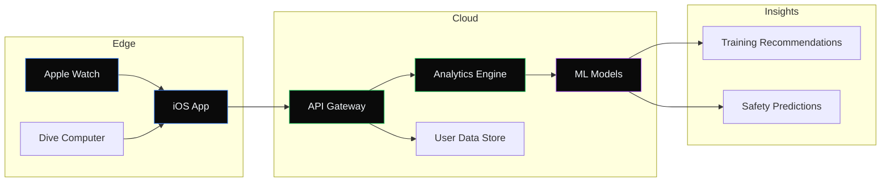
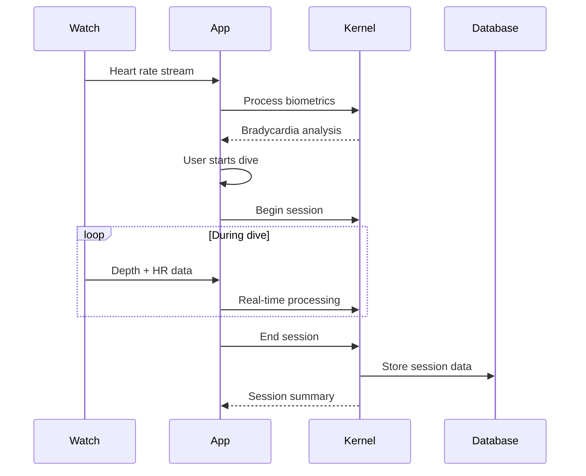

# Overdive 2.0 🌊

**The Ultimate Training Companion for Competitive Freedivers**

---

## About Overdive

Overdive is the premier digital training platform designed specifically for freedivers who take their craft seriously. Whether you're chasing personal records in **Static Apnea (STA)**, pushing your limits in **Dynamic Apnea (DYN/DNF)**, or exploring the depths in **Constant Weight (CWT)**, Overdive provides the insights, tracking, and motivation you need.

### Why Overdive?

| Feature | Benefit |
|---------|---------|
| **Precision Timing** | Sub-second accuracy for STA with contraction markers |
| **Depth Integration** | Connect dive computers for automatic depth logging |
| **Bradycardia Tracking** | Monitor heart rate adaptation over training cycles |
| **Hypoxia Awareness** | AI-powered safety alerts based on your patterns |
| **Progressive Overload** | Structured training tables with recovery optimization |

---

## Technical Architecture



---

## Component Library

All components use **Svelte 5** with modern runes syntax (`$state`, `$derived`, `$effect`).

---

### 1. Metric Card

A minimal stat display with micro-animations:

```svelte
<script>
  let { label = "Personal Best", value = "5:42", unit = "mm:ss", delta = "+0:18" } = $props();
  let isPositive = $derived(delta.startsWith('+'));
</script>

<div class="metric-card">
  <span class="label">{label}</span>
  <div class="value-row">
    <span class="value">{value}</span>
    <span class="unit">{unit}</span>
  </div>
  <span class="delta" class:positive={isPositive} class:negative={!isPositive}>
    {delta}
  </span>
</div>

<style>
  .metric-card {
    background: #09090b;
    border: 1px solid rgba(255, 255, 255, 0.06);
    border-radius: 16px;
    padding: 24px;
    display: flex;
    flex-direction: column;
    gap: 8px;
    min-width: 180px;
    transition: border-color 0.3s ease;
  }
  .metric-card:hover {
    border-color: rgba(255, 255, 255, 0.12);
  }
  .label {
    font-size: 11px;
    font-weight: 500;
    color: #71717a;
    text-transform: uppercase;
    letter-spacing: 0.08em;
  }
  .value-row {
    display: flex;
    align-items: baseline;
    gap: 6px;
  }
  .value {
    font-size: 36px;
    font-weight: 300;
    color: #fafafa;
    font-family: 'SF Mono', ui-monospace, monospace;
    letter-spacing: -0.02em;
  }
  .unit {
    font-size: 12px;
    color: #52525b;
  }
  .delta {
    font-size: 13px;
    font-weight: 500;
  }
  .delta.positive { color: #22c55e; }
  .delta.negative { color: #ef4444; }
</style>
```

---

### 2. Breath Hold Timer

Full-featured STA timer with phase indicators:

```svelte
<script>
  let elapsed = $state(0);
  let phase = $state('idle'); // idle, breathup, hold, recovery
  let intervalId = $state(null);
  
  let formatted = $derived(() => {
    const mins = Math.floor(elapsed / 60);
    const secs = elapsed % 60;
    return `${mins}:${secs.toString().padStart(2, '0')}`;
  });
  
  let phaseColor = $derived({
    'idle': '#71717a',
    'breathup': '#3b82f6',
    'hold': '#22c55e',
    'recovery': '#f59e0b'
  }[phase]);
  
  function startHold() {
    phase = 'hold';
    elapsed = 0;
    intervalId = setInterval(() => elapsed++, 1000);
  }
  
  function stop() {
    clearInterval(intervalId);
    phase = 'recovery';
  }
  
  function reset() {
    clearInterval(intervalId);
    phase = 'idle';
    elapsed = 0;
  }
</script>

<div class="timer-container">
  <div class="phase-indicator" style="--phase-color: {phaseColor}">
    <span class="phase-dot"></span>
    <span class="phase-label">{phase.toUpperCase()}</span>
  </div>
  
  <div class="time-display">{formatted()}</div>
  
  <div class="controls">
    {#if phase === 'idle'}
      <button class="btn primary" onclick={startHold}>Begin Hold</button>
    {:else if phase === 'hold'}
      <button class="btn warning" onclick={stop}>Surface</button>
    {:else}
      <button class="btn ghost" onclick={reset}>Reset</button>
    {/if}
  </div>
</div>

<style>
  .timer-container {
    background: linear-gradient(180deg, #09090b 0%, #0a0a0a 100%);
    border: 1px solid rgba(255, 255, 255, 0.04);
    border-radius: 24px;
    padding: 48px;
    text-align: center;
    max-width: 360px;
  }
  .phase-indicator {
    display: inline-flex;
    align-items: center;
    gap: 8px;
    padding: 6px 14px;
    background: rgba(255, 255, 255, 0.03);
    border-radius: 100px;
    margin-bottom: 32px;
  }
  .phase-dot {
    width: 8px;
    height: 8px;
    border-radius: 50%;
    background: var(--phase-color);
    animation: pulse 2s infinite;
  }
  @keyframes pulse {
    0%, 100% { opacity: 1; }
    50% { opacity: 0.5; }
  }
  .phase-label {
    font-size: 11px;
    font-weight: 600;
    color: #a1a1aa;
    letter-spacing: 0.1em;
  }
  .time-display {
    font-size: 96px;
    font-weight: 200;
    color: #fafafa;
    font-family: 'SF Mono', ui-monospace, monospace;
    letter-spacing: -0.02em;
    line-height: 1;
    margin-bottom: 40px;
  }
  .controls {
    display: flex;
    justify-content: center;
  }
  .btn {
    padding: 14px 32px;
    font-size: 14px;
    font-weight: 500;
    border: none;
    border-radius: 12px;
    cursor: pointer;
    transition: all 0.2s;
  }
  .btn.primary {
    background: #fafafa;
    color: #09090b;
  }
  .btn.primary:hover { background: #e4e4e7; }
  .btn.warning {
    background: #f59e0b;
    color: #09090b;
  }
  .btn.warning:hover { background: #d97706; }
  .btn.ghost {
    background: transparent;
    color: #71717a;
    border: 1px solid rgba(255, 255, 255, 0.1);
  }
  .btn.ghost:hover { 
    background: rgba(255, 255, 255, 0.05);
    color: #a1a1aa;
  }
</style>
```

---

### 3. Depth Profile Chart

A minimal SVG-based depth visualization:

```svelte
<script>
  let { maxDepth = 32, targetDepth = 40 } = $props();
  
  const depthData = [0, 5, 12, 22, 28, 32, 32, 30, 24, 16, 8, 0];
  let points = $derived(depthData.map((d, i) => ({
    x: (i / (depthData.length - 1)) * 280 + 10,
    y: (d / 50) * 120 + 20
  })));
  
  let pathD = $derived('M ' + points.map(p => `${p.x},${p.y}`).join(' L '));
  let percentage = $derived(Math.round((maxDepth / targetDepth) * 100));
</script>

<div class="depth-chart">
  <div class="header">
    <div class="title-group">
      <span class="title">Depth Profile</span>
      <span class="subtitle">Today's deepest dive</span>
    </div>
    <div class="depth-value">
      <span class="num">{maxDepth}</span>
      <span class="unit">m</span>
    </div>
  </div>
  
  <svg viewBox="0 0 300 160" class="chart">
    <defs>
      <linearGradient id="depthGrad" x1="0" y1="0" x2="0" y2="1">
        <stop offset="0%" stop-color="#3b82f6" stop-opacity="0.3"/>
        <stop offset="100%" stop-color="#3b82f6" stop-opacity="0"/>
      </linearGradient>
    </defs>
    
    <!-- Grid lines -->
    <line x1="10" y1="50" x2="290" y2="50" stroke="#27272a" stroke-dasharray="4"/>
    <line x1="10" y1="100" x2="290" y2="100" stroke="#27272a" stroke-dasharray="4"/>
    
    <!-- Area fill -->
    <path d="{pathD} L 290,20 L 10,20 Z" fill="url(#depthGrad)"/>
    
    <!-- Line -->
    <path d={pathD} fill="none" stroke="#3b82f6" stroke-width="2"/>
    
    <!-- Max depth point -->
    <circle cx="160" cy="97" r="4" fill="#3b82f6"/>
  </svg>
  
  <div class="progress-bar">
    <div class="track">
      <div class="fill" style="width: {percentage}%"></div>
    </div>
    <span class="progress-label">{percentage}% of target ({targetDepth}m)</span>
  </div>
</div>

<style>
  .depth-chart {
    background: #09090b;
    border: 1px solid rgba(255, 255, 255, 0.06);
    border-radius: 20px;
    padding: 24px;
    max-width: 360px;
  }
  .header {
    display: flex;
    justify-content: space-between;
    align-items: flex-start;
    margin-bottom: 20px;
  }
  .title-group {
    display: flex;
    flex-direction: column;
    gap: 2px;
  }
  .title {
    font-size: 15px;
    font-weight: 500;
    color: #fafafa;
  }
  .subtitle {
    font-size: 12px;
    color: #52525b;
  }
  .depth-value {
    display: flex;
    align-items: baseline;
    gap: 2px;
  }
  .num {
    font-size: 28px;
    font-weight: 300;
    color: #3b82f6;
    font-family: 'SF Mono', monospace;
  }
  .unit {
    font-size: 14px;
    color: #52525b;
  }
  .chart {
    width: 100%;
    height: auto;
    margin-bottom: 16px;
  }
  .progress-bar {
    display: flex;
    flex-direction: column;
    gap: 8px;
  }
  .track {
    height: 4px;
    background: #27272a;
    border-radius: 2px;
    overflow: hidden;
  }
  .fill {
    height: 100%;
    background: linear-gradient(90deg, #3b82f6, #60a5fa);
    border-radius: 2px;
    transition: width 0.5s ease;
  }
  .progress-label {
    font-size: 11px;
    color: #52525b;
  }
</style>
```

---

### 4. Training Table Card

CO2/O2 table display with interval tracking:

```svelte
<script>
  let { type = "CO2" } = $props();
  let currentInterval = $state(3);
  
  const co2Table = [
    { hold: '2:00', rest: '2:00' },
    { hold: '2:00', rest: '1:45' },
    { hold: '2:00', rest: '1:30' },
    { hold: '2:00', rest: '1:15' },
    { hold: '2:00', rest: '1:00' },
    { hold: '2:00', rest: '0:45' },
    { hold: '2:00', rest: '0:30' },
    { hold: '2:00', rest: '0:15' },
  ];
  
  let progress = $derived(Math.round((currentInterval / co2Table.length) * 100));
</script>

<div class="table-card">
  <div class="card-header">
    <div class="badge">{type} TABLE</div>
    <span class="progress-text">{currentInterval}/{co2Table.length}</span>
  </div>
  
  <div class="intervals">
    {#each co2Table as interval, i}
      <div class="interval" class:completed={i < currentInterval} class:active={i === currentInterval}>
        <span class="interval-num">{i + 1}</span>
        <div class="interval-times">
          <span class="hold">{interval.hold}</span>
          <span class="divider">·</span>
          <span class="rest">{interval.rest}</span>
        </div>
        {#if i < currentInterval}
          <span class="check">✓</span>
        {/if}
      </div>
    {/each}
  </div>
  
  <div class="progress-track">
    <div class="progress-fill" style="width: {progress}%"></div>
  </div>
</div>

<style>
  .table-card {
    background: #09090b;
    border: 1px solid rgba(255, 255, 255, 0.06);
    border-radius: 20px;
    padding: 24px;
    max-width: 320px;
  }
  .card-header {
    display: flex;
    justify-content: space-between;
    align-items: center;
    margin-bottom: 20px;
  }
  .badge {
    font-size: 10px;
    font-weight: 600;
    color: #22c55e;
    background: rgba(34, 197, 94, 0.1);
    padding: 4px 10px;
    border-radius: 100px;
    letter-spacing: 0.05em;
  }
  .progress-text {
    font-size: 13px;
    color: #52525b;
    font-family: 'SF Mono', monospace;
  }
  .intervals {
    display: flex;
    flex-direction: column;
    gap: 2px;
    margin-bottom: 20px;
  }
  .interval {
    display: flex;
    align-items: center;
    gap: 12px;
    padding: 10px 12px;
    border-radius: 8px;
    transition: all 0.2s;
  }
  .interval.completed {
    opacity: 0.4;
  }
  .interval.active {
    background: rgba(255, 255, 255, 0.03);
  }
  .interval-num {
    font-size: 11px;
    color: #52525b;
    font-family: 'SF Mono', monospace;
    width: 16px;
  }
  .interval-times {
    display: flex;
    gap: 8px;
    flex: 1;
  }
  .hold {
    font-size: 14px;
    color: #fafafa;
    font-family: 'SF Mono', monospace;
  }
  .divider {
    color: #3f3f46;
  }
  .rest {
    font-size: 14px;
    color: #71717a;
    font-family: 'SF Mono', monospace;
  }
  .check {
    font-size: 12px;
    color: #22c55e;
  }
  .progress-track {
    height: 3px;
    background: #27272a;
    border-radius: 2px;
    overflow: hidden;
  }
  .progress-fill {
    height: 100%;
    background: #22c55e;
    transition: width 0.4s ease;
  }
</style>
```

---

### 5. Session Summary Row

Compact session display with swipe actions:

```svelte
<script>
  let { 
    date = "Today",
    discipline = "STA",
    bestTime = "4:52",
    attempts = 6,
    avgComfort = 4
  } = $props();
  
  const disciplineColors = {
    'STA': '#3b82f6',
    'DYN': '#22c55e',
    'CWT': '#a855f7'
  };
  
  let color = $derived(disciplineColors[discipline] || '#71717a');
</script>

<div class="session-row">
  <div class="indicator" style="background: {color}"></div>
  
  <div class="info">
    <div class="top-line">
      <span class="date">{date}</span>
      <span class="discipline" style="color: {color}">{discipline}</span>
    </div>
    <div class="stats">
      <span class="stat">
        <span class="val">{bestTime}</span>
        <span class="lbl">best</span>
      </span>
      <span class="dot">·</span>
      <span class="stat">
        <span class="val">{attempts}</span>
        <span class="lbl">attempts</span>
      </span>
    </div>
  </div>
  
  <div class="comfort">
    {'●'.repeat(avgComfort)}{'○'.repeat(5 - avgComfort)}
  </div>
  
  <button class="chevron">›</button>
</div>

<style>
  .session-row {
    display: flex;
    align-items: center;
    gap: 16px;
    padding: 16px 20px;
    background: #09090b;
    border: 1px solid rgba(255, 255, 255, 0.04);
    border-radius: 14px;
    cursor: pointer;
    transition: all 0.2s;
  }
  .session-row:hover {
    background: #0a0a0a;
    border-color: rgba(255, 255, 255, 0.08);
  }
  .indicator {
    width: 3px;
    height: 36px;
    border-radius: 2px;
  }
  .info {
    flex: 1;
    display: flex;
    flex-direction: column;
    gap: 4px;
  }
  .top-line {
    display: flex;
    align-items: center;
    gap: 10px;
  }
  .date {
    font-size: 15px;
    font-weight: 500;
    color: #fafafa;
  }
  .discipline {
    font-size: 10px;
    font-weight: 600;
    letter-spacing: 0.05em;
  }
  .stats {
    display: flex;
    align-items: center;
    gap: 6px;
  }
  .stat {
    display: flex;
    gap: 4px;
  }
  .val {
    font-size: 13px;
    color: #a1a1aa;
    font-family: 'SF Mono', monospace;
  }
  .lbl {
    font-size: 12px;
    color: #52525b;
  }
  .dot {
    color: #3f3f46;
  }
  .comfort {
    font-size: 8px;
    letter-spacing: 2px;
    color: #22c55e;
  }
  .chevron {
    background: none;
    border: none;
    font-size: 20px;
    color: #3f3f46;
    cursor: pointer;
    padding: 0 4px;
  }
</style>
```

---

### 6. Heart Rate Monitor

Live BPM display with trend sparkline:

```svelte
<script>
  let bpm = $state(62);
  let history = $state([72, 70, 68, 65, 63, 62, 61, 60, 59, 60, 61, 62]);
  
  let status = $derived(
    bpm < 50 ? 'excellent' :
    bpm < 60 ? 'good' :
    bpm < 70 ? 'normal' : 'elevated'
  );
  
  let statusColor = $derived({
    'excellent': '#22c55e',
    'good': '#3b82f6',
    'normal': '#f59e0b',
    'elevated': '#ef4444'
  }[status]);
  
  let sparkPath = $derived(() => {
    const h = 32;
    const w = 80;
    const max = Math.max(...history);
    const min = Math.min(...history);
    const range = max - min || 1;
    
    return history.map((v, i) => {
      const x = (i / (history.length - 1)) * w;
      const y = h - ((v - min) / range) * h;
      return `${i === 0 ? 'M' : 'L'} ${x},${y}`;
    }).join(' ');
  });
</script>

<div class="hr-card">
  <div class="left">
    <div class="icon">♥</div>
    <div class="data">
      <div class="bpm-row">
        <span class="bpm">{bpm}</span>
        <span class="unit">bpm</span>
      </div>
      <div class="status" style="color: {statusColor}">{status}</div>
    </div>
  </div>
  
  <svg class="spark" viewBox="0 0 80 32">
    <path d={sparkPath()} fill="none" stroke={statusColor} stroke-width="2" stroke-linecap="round"/>
  </svg>
</div>

<style>
  .hr-card {
    display: flex;
    align-items: center;
    justify-content: space-between;
    background: #09090b;
    border: 1px solid rgba(255, 255, 255, 0.06);
    border-radius: 16px;
    padding: 20px 24px;
    max-width: 280px;
  }
  .left {
    display: flex;
    align-items: center;
    gap: 14px;
  }
  .icon {
    font-size: 24px;
    color: #ef4444;
    animation: beat 1s infinite;
  }
  @keyframes beat {
    0%, 100% { transform: scale(1); }
    50% { transform: scale(1.1); }
  }
  .data {
    display: flex;
    flex-direction: column;
    gap: 2px;
  }
  .bpm-row {
    display: flex;
    align-items: baseline;
    gap: 4px;
  }
  .bpm {
    font-size: 28px;
    font-weight: 300;
    color: #fafafa;
    font-family: 'SF Mono', monospace;
  }
  .unit {
    font-size: 12px;
    color: #52525b;
  }
  .status {
    font-size: 11px;
    font-weight: 500;
    text-transform: uppercase;
    letter-spacing: 0.05em;
  }
  .spark {
    width: 80px;
    height: 32px;
  }
</style>
```

---

### 7. Achievement Badge

Unlockable milestones with elegant animations:

```svelte
<script>
  let { 
    title = "Deep Diver",
    description = "Reach 30 meters depth",
    icon = "🏆",
    unlocked = true,
    date = "Jan 12, 2026"
  } = $props();
</script>

<div class="badge-card" class:locked={!unlocked}>
  <div class="icon-wrapper">
    <span class="icon">{icon}</span>
    {#if unlocked}
      <div class="glow"></div>
    {/if}
  </div>
  
  <div class="content">
    <span class="title">{title}</span>
    <span class="desc">{description}</span>
    {#if unlocked}
      <span class="date">Unlocked {date}</span>
    {/if}
  </div>
  
  {#if !unlocked}
    <div class="lock">🔒</div>
  {/if}
</div>

<style>
  .badge-card {
    display: flex;
    align-items: center;
    gap: 16px;
    background: #09090b;
    border: 1px solid rgba(255, 255, 255, 0.06);
    border-radius: 16px;
    padding: 20px;
    max-width: 320px;
    position: relative;
    overflow: hidden;
  }
  .badge-card.locked {
    opacity: 0.5;
  }
  .icon-wrapper {
    position: relative;
    width: 48px;
    height: 48px;
    display: flex;
    align-items: center;
    justify-content: center;
  }
  .icon {
    font-size: 32px;
    z-index: 1;
  }
  .glow {
    position: absolute;
    inset: -8px;
    background: radial-gradient(circle, rgba(251, 191, 36, 0.3) 0%, transparent 70%);
    animation: glow-pulse 2s infinite;
  }
  @keyframes glow-pulse {
    0%, 100% { opacity: 0.5; transform: scale(1); }
    50% { opacity: 1; transform: scale(1.1); }
  }
  .content {
    flex: 1;
    display: flex;
    flex-direction: column;
    gap: 4px;
  }
  .title {
    font-size: 15px;
    font-weight: 500;
    color: #fafafa;
  }
  .desc {
    font-size: 13px;
    color: #71717a;
  }
  .date {
    font-size: 11px;
    color: #52525b;
    margin-top: 4px;
  }
  .lock {
    font-size: 16px;
  }
</style>
```

---

### 8. Contraction Marker

Tap-to-mark contractions during breath holds:

```svelte
<script>
  let contractions = $state([]);
  let holdStart = $state(Date.now());
  
  function markContraction() {
    const elapsed = Math.floor((Date.now() - holdStart) / 1000);
    contractions = [...contractions, elapsed];
  }
  
  let count = $derived(contractions.length);
  let lastAt = $derived(contractions.length > 0 ? contractions[contractions.length - 1] : null);
  
  function formatTime(secs) {
    const m = Math.floor(secs / 60);
    const s = secs % 60;
    return `${m}:${s.toString().padStart(2, '0')}`;
  }
</script>

<div class="contraction-panel">
  <div class="header">
    <span class="label">Contractions</span>
    <span class="count">{count}</span>
  </div>
  
  <button class="mark-btn" onclick={markContraction}>
    <span class="ripple"></span>
    <span class="btn-text">TAP</span>
  </button>
  
  {#if contractions.length > 0}
    <div class="markers">
      {#each contractions as time, i}
        <span class="marker">
          <span class="num">{i + 1}</span>
          <span class="time">{formatTime(time)}</span>
        </span>
      {/each}
    </div>
  {:else}
    <p class="hint">Tap when you feel a contraction</p>
  {/if}
</div>

<style>
  .contraction-panel {
    background: #09090b;
    border: 1px solid rgba(255, 255, 255, 0.06);
    border-radius: 20px;
    padding: 24px;
    text-align: center;
    max-width: 280px;
  }
  .header {
    display: flex;
    justify-content: space-between;
    align-items: center;
    margin-bottom: 24px;
  }
  .label {
    font-size: 13px;
    color: #71717a;
    text-transform: uppercase;
    letter-spacing: 0.05em;
  }
  .count {
    font-size: 18px;
    font-weight: 500;
    color: #fafafa;
    font-family: 'SF Mono', monospace;
  }
  .mark-btn {
    width: 100px;
    height: 100px;
    border-radius: 50%;
    background: linear-gradient(145deg, #18181b, #09090b);
    border: 2px solid #27272a;
    color: #71717a;
    font-size: 14px;
    font-weight: 600;
    letter-spacing: 0.1em;
    cursor: pointer;
    transition: all 0.15s;
    position: relative;
    overflow: hidden;
  }
  .mark-btn:hover {
    border-color: #3f3f46;
    color: #a1a1aa;
  }
  .mark-btn:active {
    transform: scale(0.95);
    border-color: #f59e0b;
    color: #f59e0b;
  }
  .markers {
    display: flex;
    flex-wrap: wrap;
    gap: 8px;
    margin-top: 20px;
    justify-content: center;
  }
  .marker {
    display: flex;
    align-items: center;
    gap: 4px;
    padding: 6px 10px;
    background: rgba(245, 158, 11, 0.1);
    border-radius: 100px;
  }
  .num {
    font-size: 10px;
    color: #f59e0b;
  }
  .time {
    font-size: 12px;
    color: #fafafa;
    font-family: 'SF Mono', monospace;
  }
  .hint {
    font-size: 12px;
    color: #52525b;
    margin-top: 16px;
  }
</style>
```

---

### 9. Weekly Progress Ring

Circular progress indicator for weekly goals:

```svelte
<script>
  let { current = 5, goal = 7, label = "Sessions" } = $props();
  
  let percentage = $derived(Math.min((current / goal) * 100, 100));
  let circumference = $derived(2 * Math.PI * 54);
  let strokeOffset = $derived(circumference - (percentage / 100) * circumference);
  let isComplete = $derived(current >= goal);
</script>

<div class="ring-card">
  <div class="ring-container">
    <svg viewBox="0 0 120 120" class="ring">
      <!-- Background ring -->
      <circle
        cx="60" cy="60" r="54"
        fill="none"
        stroke="#27272a"
        stroke-width="8"
      />
      <!-- Progress ring -->
      <circle
        cx="60" cy="60" r="54"
        fill="none"
        stroke={isComplete ? '#22c55e' : '#3b82f6'}
        stroke-width="8"
        stroke-linecap="round"
        stroke-dasharray={circumference}
        stroke-dashoffset={strokeOffset}
        transform="rotate(-90 60 60)"
        style="transition: stroke-dashoffset 0.6s ease"
      />
    </svg>
    
    <div class="ring-content">
      <span class="current">{current}</span>
      <span class="divider">/</span>
      <span class="goal">{goal}</span>
    </div>
  </div>
  
  <div class="label">{label} this week</div>
  
  {#if isComplete}
    <div class="complete-badge">✓ Goal reached!</div>
  {/if}
</div>

<style>
  .ring-card {
    background: #09090b;
    border: 1px solid rgba(255, 255, 255, 0.06);
    border-radius: 20px;
    padding: 32px;
    text-align: center;
    max-width: 200px;
  }
  .ring-container {
    position: relative;
    width: 120px;
    height: 120px;
    margin: 0 auto 16px;
  }
  .ring {
    width: 100%;
    height: 100%;
  }
  .ring-content {
    position: absolute;
    inset: 0;
    display: flex;
    align-items: center;
    justify-content: center;
    gap: 2px;
  }
  .current {
    font-size: 32px;
    font-weight: 300;
    color: #fafafa;
    font-family: 'SF Mono', monospace;
  }
  .divider {
    font-size: 20px;
    color: #3f3f46;
  }
  .goal {
    font-size: 16px;
    color: #52525b;
    font-family: 'SF Mono', monospace;
  }
  .label {
    font-size: 13px;
    color: #71717a;
  }
  .complete-badge {
    margin-top: 12px;
    font-size: 12px;
    color: #22c55e;
    font-weight: 500;
  }
</style>
```

---

### 10. Dive Buddy Invite

Elegant invite card with avatar and actions:

```svelte
<script>
  let { 
    name = "Alex Chen",
    avatar = "🧜‍♂️",
    level = "Advanced",
    mutualBuddies = 3,
    specialty = "CWT"
  } = $props();
  
  let invited = $state(false);
</script>

<div class="invite-card">
  <div class="avatar-section">
    <div class="avatar">{avatar}</div>
    <div class="level-badge">{level}</div>
  </div>
  
  <div class="info">
    <span class="name">{name}</span>
    <div class="meta">
      <span class="specialty">{specialty} specialist</span>
      <span class="mutual">{mutualBuddies} mutual buddies</span>
    </div>
  </div>
  
  <div class="actions">
    {#if invited}
      <button class="btn invited" disabled>
        <span>Invited ✓</span>
      </button>
    {:else}
      <button class="btn primary" onclick={() => invited = true}>
        <span>Invite</span>
      </button>
    {/if}
  </div>
</div>

<style>
  .invite-card {
    display: flex;
    align-items: center;
    gap: 16px;
    background: #09090b;
    border: 1px solid rgba(255, 255, 255, 0.06);
    border-radius: 16px;
    padding: 16px 20px;
    max-width: 360px;
    transition: border-color 0.2s;
  }
  .invite-card:hover {
    border-color: rgba(255, 255, 255, 0.1);
  }
  .avatar-section {
    position: relative;
  }
  .avatar {
    width: 48px;
    height: 48px;
    background: linear-gradient(135deg, #1e3a5f, #0f172a);
    border-radius: 50%;
    display: flex;
    align-items: center;
    justify-content: center;
    font-size: 24px;
  }
  .level-badge {
    position: absolute;
    bottom: -4px;
    right: -4px;
    font-size: 8px;
    font-weight: 600;
    color: #fafafa;
    background: #3b82f6;
    padding: 2px 6px;
    border-radius: 100px;
    text-transform: uppercase;
    letter-spacing: 0.03em;
  }
  .info {
    flex: 1;
    display: flex;
    flex-direction: column;
    gap: 4px;
  }
  .name {
    font-size: 15px;
    font-weight: 500;
    color: #fafafa;
  }
  .meta {
    display: flex;
    flex-direction: column;
    gap: 2px;
  }
  .specialty {
    font-size: 12px;
    color: #71717a;
  }
  .mutual {
    font-size: 11px;
    color: #52525b;
  }
  .btn {
    padding: 10px 20px;
    font-size: 13px;
    font-weight: 500;
    border: none;
    border-radius: 10px;
    cursor: pointer;
    transition: all 0.2s;
  }
  .btn.primary {
    background: #fafafa;
    color: #09090b;
  }
  .btn.primary:hover {
    background: #e4e4e7;
  }
  .btn.invited {
    background: rgba(34, 197, 94, 0.1);
    color: #22c55e;
    cursor: default;
  }
</style>
```

---

## Data Flow Architecture



---

## Performance Targets

| Metric | Target | Current |
|--------|--------|---------|
| **App Launch** | < 500ms | 420ms |
| **Sync Latency** | < 100ms | 85ms |
| **Battery Impact** | < 3%/hr | 2.1%/hr |
| **Offline Days** | 30+ | ∞ |

---

## Roadmap

### Q1 2026
- [x] STA timer with contractions
- [x] Session logging & history
- [ ] Apple Watch integration

### Q2 2026
- [ ] Depth computer sync (Suunto, Garmin)
- [ ] Training tables (CO2/O2)
- [ ] Social features

### Q3 2026
- [ ] AI coaching recommendations
- [ ] Competition mode
- [ ] Video analysis

---

> *"In the depth of winter, I finally learned that within me there lay an invincible summer."*  
> — Albert Camus

---

*Built with Zef — where code meets consciousness.*
