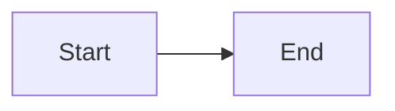

# Excalidraw Test

## Empty Excalidraw Block

```excalidraw
```

## Excalidraw with Content

```excalidraw
{
  "type": "excalidraw",
  "version": 2,
  "elements": [
    {
      "type": "rectangle",
      "x": 50,
      "y": 50,
      "width": 200,
      "height": 100,
      "strokeColor": "#ffffff",
      "backgroundColor": "#264653"
    },
    {
      "type": "ellipse",
      "x": 300,
      "y": 50,
      "width": 100,
      "height": 100,
      "strokeColor": "#e9c46a",
      "backgroundColor": "transparent"
    }
  ],
  "appState": {
    "viewBackgroundColor": "#1a1a2e"
  }
}
```

## Test Mermaid (for comparison)


